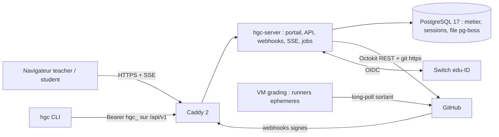

> Projet : HEIG GitHub Classroom.
> Cadre : `01-cahier-des-charges.md` (US/NFR/C, H1-H12 validées),
> `02-specs-fonctionnelles.md` (AU/GH/GR/CLI/NT).
> Statut : architecture consolidée (édition finale phase 3), issue de la revue croisée de trois
> propositions (simplicité, productivité, robustesse). Base retenue : **simplicité d'abord**,
> enrichie des mécanismes de robustesse et de productivité jugés compatibles. Chaque décision
> structurante est consignée dans un ADR (section [Décisions](#sec:decisions), fichiers
> `docs/adr/ADR-00x-*.md`).

# Vue d'ensemble et découpage

## Parti pris directeur

Un mainteneur, une technologie ennuyeuse, un minimum de pièces mobiles : chaque composant doit se
justifier contre une NFR. Le résultat est un **monolithe modulaire** — un seul processus Node.js
sert le portail (SPA statique), les API, l'endpoint webhooks, le flux SSE et exécute les jobs de
fond — adossé à une **unique base PostgreSQL** qui porte les données métier, les sessions et la
file de jobs (pas de Redis, pas de broker, pas d'orchestrateur). Voir `ADR-001` et `ADR-003`.

Justification : volumétrie faible (NFR-11 : ≤ 100 étudiants × 20 classrooms), disponibilité 99 %
(NFR-08) atteignable avec un processus supervisé, coût d'exploitation comme critère majeur
(équipe d'un enseignant). Les rafales (webhooks à la deadline, pushes en masse) sont un problème
de **file d'attente**, pas de scalabilité : l'endpoint webhook acquitte en moins de 5 s (GH-60)
et le travail réel est absorbé par la file en base avec concurrence bornée.

Une variable d'environnement `WORKER_MODE` (empruntée à la proposition productivité) permet de
scinder ultérieurement le processus en un rôle `web` et un rôle `worker` **sans changement de
code** : l'option d'évolution est gratuite, pas payée d'avance.

Règle transverse (empruntée à la proposition robustesse, `ADR-011`) : **tout événement externe
est perdable, tout job est interruptible, tout état est réconciliable**. Chaque information
critique a deux chemins d'arrivée : le webhook (nominal) et la réconciliation périodique
(secours), qui **réutilise les mêmes handlers idempotents**.

## Composants

| Composant | Rôle | Hébergement |
| --- | --- | --- |
| `hgc-server` (monolithe) | Portail, API portail, API à clé v1, webhooks, SSE, jobs et crons | VM applicative, conteneur |
| PostgreSQL 17 | Données métier, sessions, file de jobs (pg-boss), dédup webhooks, audit | Même VM, conteneur |
| Caddy 2 | Reverse proxy, TLS automatique (Let's Encrypt), HSTS | Même VM, conteneur |
| Runners de grading | Runners GitHub Actions éphémères (code étudiant) | VM séparée dédiée |
| `hgc` CLI | Client de l'API v1 (paquet npm) | Poste du teacher |

## Modules internes du monolithe

Monorepo pnpm léger (workspaces, sans Turborepo) :

| Paquet | Rôle |
| --- | --- |
| `packages/domain` | Règles métier **pures**, testables sans mock : regex GR-02, agrégation GR-06, éligibilité GR-05, calcul du gel GR-12/14 |
| `packages/contracts` | Schémas Zod partagés (types API front, back, CLI ; source unique du contrat) |
| `apps/server` | Monolithe Fastify : modules `auth`, `roster`, `assignments`, `github`, `provisioning`, `protected-files`, `deadline`, `grading`, `sync`, `metrics`, `notifications`, `api-v1`, `events`, `jobs` |
| `apps/web` | SPA React (portail teacher et student) |
| `apps/hgc` | CLI (paquet npm) |

Les frontières sont des modules TypeScript avec interfaces explicites ; aucun réseau entre eux.
Le paquet `domain` n'a aucune dépendance vers le framework ni la base : c'est là que vivent les
règles à fort enjeu de litige (gel, notes), testées exhaustivement en phase 5.

## Diagramme



Les runners n'ont **aucun** lien avec la plateforme : ils ne parlent qu'à GitHub (connexion
sortante), la plateforme ne fait que lire les résultats (C-04). La VM runner ne connaît ni la
base ni l'API de la plateforme.

# Stack et justification

| Couche | Choix | Version | Justification contre les NFR |
| --- | --- | --- | --- |
| Runtime | Node.js LTS | 22.x | Écosystème GitHub le plus mature (Octokit officiel) ; un langage unique front, back, CLI |
| Langage | TypeScript strict | 5.x | Typage partagé, refactoring sûr par assistants |
| HTTP | Fastify (`@fastify/cookie`, `@fastify/rate-limit`, `@fastify/static`) | 5.x | Léger, schémas natifs, SSE trivial, pas de DI ni de décorateurs à déboguer à 23 h (`ADR-002`) |
| Client GitHub | Octokit (`octokit`, `@octokit/webhooks`, plugins `retry` + `throttling`) | 4.x / 13.x | Backoff natif sur rate limits primaires et secondaires (NFR-10, GH-63) |
| OIDC | `openid-client` (certifié, Code + PKCE) | 6.x | AU-01 : `state`, `nonce`, PKCE de référence |
| Base | PostgreSQL | 17 | ACID, contraintes UNIQUE comme mécanisme d'idempotence, une seule chose à sauvegarder (NFR-16) |
| Accès DB | Drizzle ORM + drizzle-kit | épinglé | SQL-proche, migrations versionnées ; accès isolé derrière une couche repository (risque pré-1.0 mitigé, `ADR-003`) |
| Jobs et cron | pg-boss (file de jobs sur Postgres) | 10.x | Retries exponentiels, cron, clés singleton (NFR-09), rétention ; supprime Redis (`ADR-004`) |
| Validation | Zod (schémas partagés front, back, CLI) | 4.x | Contrat unique, OpenAPI générée |
| Front | React + Vite, TanStack Router + Query, TanStack Table, Radix UI (headless), i18next, Luxon | React 19, Vite 7 | SPA statique sans SSR (`ADR-008`) ; Radix couvre clavier et ARIA (NFR-15) ; chaînes externalisées (NFR-14) ; Europe/Zurich (C-02) |
| CLI | paquet npm `hgc` (commander + client typé v1) | — | H7, CLI-01..04 |
| Proxy | Caddy | 2.x | TLS auto, HSTS, configuration de 15 lignes |
| Observabilité | pino (redaction AU-41), `/healthz`, `/metrics` Prometheus, sonde externe 60 s | — | NFR-08 ; métriques orientées exigences (section [Déploiement](#sec:deploiement)) |

Justifications négatives, systématiques (chaque non-choix est un coût d'exploitation évité) :

- **Pas de NestJS** : surcouche DI et décorateurs non indispensable pour une trentaine
  d'endpoints ; l'autorisation systématique (AU-24) est un middleware Fastify explicite.
- **Pas de Redis ni BullMQ** : pg-boss couvre le besoin (moins de 10 jobs/s en pire rafale) sans
  deuxième composant stateful à sauvegarder et superviser.
- **Pas de SSR ni Next.js** : portail authentifié, SEO sans objet ; le front est un dossier de
  fichiers statiques.
- **Pas de JWT de session** : invalidation côté serveur exigée par AU-06 ; une table suffit.
- **Pas de Kubernetes ni microservices ni broker** : rien dans les NFR ne les justifie.

En développement, un IdP OIDC de test (Keycloak ou mock) remplace Switch edu-ID derrière
`openid-client` : la démarche d'enregistrement institutionnelle ne bloque pas le jalon M1.

# Schéma de base de données

UTC partout (`timestamptz`), conversion Europe/Zurich à l'affichage (C-02). PK `uuid` v7 (tri
temporel) sauf mention. Colonnes clés uniquement :

```text
users            id, oidc_sub UNIQUE NOT NULL, email, email_verified, given_name,
                 family_name, swiss_edu_id NULL, role (student|teacher),
                 github_user_id bigint UNIQUE NULL (AU-10), github_login,
                 github_linked_at, last_login_at (AU-27),
                 anonymized_at NULL (LPD), created_at

sessions         sid_hash char(64) PK,        -- SHA-256 du token de session (jamais en clair)
                 user_id FK, expires_at, created_at
                 INDEX (expires_at)

organizations    id, github_org_id bigint UNIQUE, login,
                 installation_id bigint UNIQUE NULL, status (active|degraded) (GH-06)

classrooms       id, org_id FK, teacher_id FK users, name, created_at

enrollments      id, classroom_id FK, nom, prenom, email (normalisé),
                 status (pending|claimed), user_id FK NULL, claimed_at,
                 conflict_flag bool (AU-21)
                 UNIQUE(classroom_id, email) ; UNIQUE(classroom_id, user_id)
                 INDEX (lower(email))                  -- claim au login (AU-18/19)

assignments      id, classroom_id FK, name, slug, state (draft|published|locked),
                 start_at, deadline_at, grace_minutes DEFAULT 30,
                 source_repo_id bigint, source_full_name,
                 squashed_repo_id bigint, squashed_full_name,
                 source_strategy (whole|squash), deadline_strategy (lock|commit),
                 branches text[], protected_files text[],
                 source_ahead_sha NULL (GH-50), deadline_applied_at NULL,
                 frozen_at NULL
                 INDEX (deadline_at) WHERE state='published'
                       AND deadline_applied_at IS NULL       -- scan du ticker deadline
                 INDEX (deadline_at) WHERE deadline_applied_at IS NOT NULL
                       AND frozen_at IS NULL                  -- gel après grâce

primary_commits  id, assignment_id FK, branch, squashed_sha char(40),
                 source_sha char(40), created_at       -- mapping GH-13.3

student_repos    id, assignment_id FK, user_id FK, github_repo_id bigint UNIQUE NULL,
                 full_name, default_branch, provision_status (pending|ok|error),
                 accepted_at, invitation_id bigint NULL,
                 invitation_status (pending|accepted|expired),
                 last_reinvite_at (GH-24), locked_at NULL, ruleset_id bigint NULL,
                 archived_fallback bool (H8), protected_conflict bool (GH-33/35),
                 last_commit_sha, last_commit_at, ci_status (none|pending|pass|fail),
                 current_grade_run_id FK NULL,
                 frozen_grade_run_id FK NULL, frozen_final bool DEFAULT false
                 UNIQUE(assignment_id, user_id)        -- clé d'idempotence GH-20

push_receipts    id, student_repo_id FK, branch, head_sha char(40),
                 received_at NOT NULL,                 -- heure serveur = référence gel
                 is_bot bool, forced bool (GH-22)
                 UNIQUE(student_repo_id, head_sha)     -- GR-14, résolution O(1) au gel

bot_commits      student_repo_id FK, sha char(40), kind (revert|deadline|sync)
                 PK(student_repo_id, sha)              -- filtre déterministe GR-05/GH-44

grade_runs       id, student_repo_id FK, workflow_run_id bigint, run_attempt int,
                 head_branch, head_sha, conclusion, grade_points numeric NULL,
                 grade_max numeric NULL,
                 parse_status (ok|no_annotation|malformed|multiple|fallback),
                 after_deadline bool, completed_at, created_at   -- immuable (GR-08)
                 UNIQUE(student_repo_id, workflow_run_id, run_attempt)
                 INDEX (student_repo_id, completed_at DESC)
                       WHERE after_deadline = false    -- note courante GR-09

reverts          id, student_repo_id FK, revert_sha, files text[], created_at
                 INDEX (student_repo_id, created_at)   -- plafond 5/h (GH-33, H10)

sync_batches     id, assignment_id FK, source_sha, started_at, finished_at,
                 summary jsonb                         -- récapitulatif US-06

sync_prs         id, sync_batch_id FK, student_repo_id FK, pr_number int,
                 state (open|merged|closed|conflict), source_sha, updated_at
                 UNIQUE(student_repo_id, pr_number)

api_keys         id, teacher_id FK, label, key_prefix char(12), key_hash char(64),
                 scopes text[], classroom_ids uuid[] NULL ('*'=NULL),
                 expires_at, last_used_at, revoked_at NULL     (AU-30)
                 INDEX (key_prefix)

notifications    id, user_id FK, type, payload jsonb, read_at NULL, emailed_at NULL,
                 created_at
                 INDEX (user_id, read_at)

audit_log        id bigserial, actor_user_id NULL, actor_type (user|system|api_key),
                 action, subject_type, subject_id, payload jsonb, created_at
                 -- append-only : rôle SQL applicatif SANS UPDATE/DELETE sur cette
                 -- table ; seule la routine de pseudonymisation NFR-07 (rôle dédié)
                 -- peut réécrire les champs d'identité

webhook_deliveries delivery_id uuid PK (X-GitHub-Delivery), event, action,
                 payload jsonb,                        -- diagnostic, purge > 30 j
                 received_at, processed_at NULL, error text NULL
                 INDEX (received_at) WHERE processed_at IS NULL   -- métrique de retard

(+ schéma pgboss.* géré par pg-boss)
```

Points saillants :

1. Les contraintes UNIQUE **sont** le mécanisme d'idempotence : un rejeu (webhook dupliqué, job
   relancé) se termine en `ON CONFLICT DO NOTHING`, jamais en doublon (NFR-09).
2. `push_receipts.received_at` est écrit **synchronement** dans le handler webhook : l'heure de
   réception (donnée légale du gel, GR-14/H6) ne dépend jamais du retard de la file
   (`ADR-012`).
3. `sessions` ne stocke qu'un **hash** du token (emprunt productivité) : une fuite de la table ne
   permet pas de rejouer une session.
4. Les payloads webhooks sont conservés 30 jours pour le diagnostic des litiges de deadline
   (emprunt robustesse), puis purgés par cron ; finalité et durée sont documentées au registre
   LPD.
5. Conformité C-01 : `student_repos.last_*` et `ci_status` sont des caches reconstructibles
   depuis GitHub ; `users`, `enrollments`, `assignments`, `api_keys`, `grade_runs`,
   `audit_log` et les gels sont la source de vérité, donc le périmètre de sauvegarde NFR-16.

# Architecture GitHub

## GitHub App et tokens

- Une GitHub App unique (GH-01), permissions strictement celles du tableau GH-02 — **aucune
  permission organisation supplémentaire** (l'enregistrement des runners se fait hors App,
  voir la section [Déploiement](#sec:deploiement) et `ADR-007`). Création par **manifest flow**
  (configuration reproductible).
- Authentification : JWT (clé privée PEM, ≤ 10 min) → token d'installation (1 h). Cache
  in-memory par `installation_id`, renouvellement à T−10 min (GH-03), géré nativement par
  `@octokit/auth-app`. Jamais persisté en base, jamais exposé au front. Pushes git via
  `https://x-access-token:<token>@github.com/...`.
- Un seul processus, donc pas de cache distribué à synchroniser.
- Client centralisé (module `github`) avec plugins `throttling` et `retry` : backoff automatique
  sur 403 primaire et secondaire, puis échec du job repris par pg-boss avec backoff exponentiel —
  le travail n'est jamais perdu (GH-63, NFR-10). Chaque **mutation** GitHub (dépôt, opération,
  SHA avant et après) est journalisée dans `audit_log`.
- Rotation de la clé privée : GitHub accepte deux clés actives simultanément ; la procédure
  (génération, bascule, révocation) figure au runbook (`ADR-010`).
- Budget quota : 5 000 req/h par installation. Pire cas mesuré (deadline sur 100 dépôts :
  3 à 4 requêtes par dépôt, soit environ 400) : marge d'un facteur 10.

## Webhooks : réception, déduplication, file

`POST /webhooks/github` (GH-60) :

1. Vérification HMAC `X-Hub-Signature-256` (`@octokit/webhooks`, comparaison temps constant) ;
   rejet 401 comptabilisé (NFR-04).
2. Déduplication : `INSERT ... ON CONFLICT DO NOTHING` sur `webhook_deliveries(delivery_id)` ;
   doublon = 200 immédiat.
3. Pour un `push` sur un `student_repo` : écriture **synchrone** de `push_receipts` — l'heure de
   réception serveur est la référence du gel (GR-14) et ne doit pas dépendre de la file.
4. Enfilage pg-boss (`webhook.push`, `webhook.workflow_run`, `webhook.pull_request`,
   `webhook.installation`, `webhook.repository`), puis **200 en moins de 5 s** (mesuré : moins
   de 100 ms). Tout le reste (compare protected files, extraction de note, PR de synchro) est
   asynchrone.

Rafale de deadline (100 pushes + 100 `workflow_run` en quelques minutes) : l'ingestion coûte
deux INSERT ; le drain se fait à concurrence bornée (10 workers par type de job) sans jamais
menacer l'acquittement. Échec de handler : 5 tentatives à backoff exponentiel, puis
**dead-letter** visible dans l'écran d'administration technique (emprunt robustesse) avec alerte
log.

## Idempotence

- **Provisionnement** : job singleton pg-boss clé `assignment_id:user_id` +
  `UNIQUE(assignment_id, user_id)` ; chaque étape vérifie l'état avant d'agir (repo existe ?
  invitation existe ? ruleset posé ?) — reprise sans doublon (GH-20, NFR-09). Le débit d'envoi
  des invitations est borné par un **rate limiter configurable** (plan B C-07.3 : étalement
  automatique si le quota mesuré en S2 est inférieur à l'effectif).
- **GradeRuns** : `UNIQUE(repo, run_id, run_attempt)` (GR-05.4).
- **Deadline** : `deadline_applied_at` + `locked_at` et `bot_commits` par dépôt — réexécution
  sans double application (US-22).
- **Reverts** : update de ref **fast-forward non forcé** ; une course échoue proprement et le
  webhook suivant redéclenche (GH-34).

## Jobs, deadline à la minute, rattrapage

**Pas de job one-shot planifié** (fragile si deadline modifiée ou processus arrêté). Un
**ticker unique** fait office de garantie (`ADR-006`) :

1. Toutes les **20 s** (in-process, protégé par advisory lock Postgres — sûr même en cas de
   scission `WORKER_MODE`), il exécute : `SELECT ... FROM assignments WHERE state='published'
   AND deadline_at <= now() AND deadline_applied_at IS NULL`, puis enfile un job
   `deadline.apply(assignment)` (singleton). Démarrage ≤ 60 s garanti (NFR-13) ;
   **replanification** (US-08, GH-43) gratuite (le ticker relit la table) ; **rattrapage après
   panne** de n'importe quelle durée gratuit (la condition reste vraie), sans double application.
2. `deadline.apply` fan-out en jobs par dépôt (concurrence 10 ; 1 à 2 appels API par dépôt,
   donc 100 dépôts très en deçà de 5 min). Stratégie `lock` : ruleset lock branch, bypass App et
   Org admin (GH-41), fallback archivage signalé (H8) ; stratégie `commit` : commit vide bot par
   branche, SHA enregistrés dans `bot_commits` (GH-42/44). Les échecs individuels restent en
   retry sans bloquer les autres dépôts.
3. **Gel en deux temps** (emprunt productivité, lecture littérale de GR-12/14.4, `ADR-012`) :
   à l'application de la deadline, `frozen_grade_run_id` est posé **provisoirement** (note
   courante GR-09 à cet instant). Pendant le délai de grâce, seuls les runs portant sur des
   commits **reçus avant la deadline** (`push_receipts`) peuvent encore l'améliorer. Le ticker
   de gel (même mécanique, scan sur `frozen_at IS NULL`) pose `frozen_at` et `frozen_final` à
   `deadline + grace_minutes` : la note gelée devient définitive et immuable.
4. Timezone : deadlines saisies en Europe/Zurich, converties en UTC via Luxon à l'écriture (les
   changements d'heure sont résolus à la saisie) ; le ticker compare des instants UTC (C-02).

## Réconciliation périodique (le polling de secours)

Règle structurante (`ADR-011`) : la réconciliation **réutilise les mêmes handlers idempotents
que les webhooks** — un seul code de mise à jour d'état, deux sources de déclenchement. C'est
aussi le plan de reprise après restauration (NFR-16).

| Cron pg-boss | Période | Rôle |
| --- | --- | --- |
| `reconcile.grades` | 15 min | GR-07 : re-interroge les runs des dépôts sans webhook depuis plus de 30 min |
| `reconcile.repos` | 24 h | SHA de tête des branches vs base ; invitations expirées, ré-invitation ≤ 1/24 h (GH-24) |
| `reconcile.deliveries` | 24 h | `GET /app/hook/deliveries` : livraisons en échec, redelivery API (GH-62) |
| `notify.email` | continu | Envoi e-mails opt-in avec retries (NT-02, NFR-17) |
| `purge.housekeeping` | 24 h | Purge sessions expirées, payloads webhooks > 30 j, archives pg-boss |

Les périodes ci-dessus sont des **valeurs par défaut** : elles sont configurables à chaud
depuis l'écran admin (table `scheduled_tasks` — période, activation, exécution manuelle,
état du dernier passage). Le ticker relit la table à chaque tour ; un changement de période
prend effet sans redémarrage. Les tâches dont le domaine est aussi couvert par les webhooks
sont marquées « webhook-woken » dans l'UI : l'événement entrant est traité immédiatement,
la planification n'est que le filet. `reconcile.grades` arrive avec M5, `notify.email`
avec les notifications (NT-02).

# Temps réel : SSE

**Choix : Server-Sent Events, pas WebSocket** (`ADR-005`).

- Le besoin est strictement **unidirectionnel** (statut CI, note, notifications vers le
  navigateur ; GR-10, NT-01). Le canal montant existe déjà : REST.
- SSE est du HTTP simple : cookies de session AU-06 réutilisés tels quels, reconnexion
  automatique native (`EventSource`), traversée de Caddy avec `flush_interval -1` sur la route,
  testable au `curl`.
- WebSocket apporterait du bidirectionnel inutile, une bibliothèque serveur et une gestion de
  ping-pong et d'authentification dédiée — du code d'exploitation pour rien.

Implémentation : endpoint `GET /app/events` (session requise), **hors** de la surface `/api/v1`
qui reste réservée à l'API à clé (correction d'une confusion relevée en revue). Bus in-process
(EventEmitter) alimenté par les modules ; filtrage par autorisation (un student ne reçoit que
ses dépôts, AU-26). **Reprise volontairement simple** : pas de replay `Last-Event-ID` ni de ring
buffer à maintenir — à la (re)connexion, le front réémet ses requêtes TanStack Query. Heartbeat
`:ping` toutes les 25 s. Dégradation : sans SSE, refetch périodique 30 s — aucune exigence
fonctionnelle ne dépend du temps réel. Volume : environ 200 connexions simultanées au maximum,
trivial pour un processus Node. Si `WORKER_MODE` scinde un jour les rôles, le relais passe par
`LISTEN/NOTIFY` Postgres — toujours sans Redis.

# Contrat API

Deux surfaces, même processus, séparation stricte des plans d'authentification :

| | API portail | API à clé (CLI `hgc`) |
| --- | --- | --- |
| Base | `/app/api/...` (+ `/app/events` pour SSE) | `/api/v1/...` |
| Style | REST JSON, non versionnée (couplée au front, déployés ensemble) | REST JSON, versionnée par URI (`v1`), contrat stable ; breaking = `v2`, `v1` maintenue un semestre |
| Auth | Cookie de session `HttpOnly Secure SameSite=Lax`, 12 h, hash en base (AU-06) | `Authorization: Bearer hgc_...` (AU-34) |
| Anti-CSRF | SameSite=Lax **et** token double-submit (cookie lisible + en-tête `X-CSRF-Token`) exigé sur toute mutation | Sans objet (pas de cookie) |
| Droits | Rôles et ownership revérifiés serveur à chaque requête (AU-23/24) via middleware systématique | Lecture seule, scopes `classrooms:read` / `repos:read` (AU-31), périmètre = classrooms du teacher (AU-33) |
| Erreurs | JSON `{error, message}` | 401/403/404 selon AU-34 (404 indiscernable du hors-périmètre), 429 + `Retry-After` (AU-39) |
| Format | — | Enveloppe `{data, pagination}` (AU-35), nullables explicites (AU-36) |

Schémas Zod partagés (`packages/contracts`) : validation des entrées, types front et CLI,
génération OpenAPI 3.1 (`@fastify/swagger`) pour `/api/v1`. Rate limiting `@fastify/rate-limit` :
120 req/min par clé ; callbacks OIDC/OAuth et claim limités par IP (AU-39). Le CLI `hgc`
(CLI-01..04) consomme le client typé généré ; clone avec les credentials git propres du teacher
(AU-37), parallélisme borné à 4.

# Sécurité

- **Tokens** : aucun token utilisateur persisté — le token OAuth GitHub est jeté après lecture
  de l'identité (AU-09, NFR-02, C-06) ; tokens OIDC jamais exposés au front ; tokens
  d'installation en mémoire uniquement (GH-03).
- **Sessions** : token aléatoire 256 bits, seul le **SHA-256 est stocké** en base ; invalidation
  côté serveur (AU-06).
- **Clés API** : `hgc_` + 40 caractères CSPRNG ; stockage `key_prefix` + SHA-256 ; lookup par
  prefix indexé puis comparaison temps constant (`crypto.timingSafeEqual`) ; révocation et
  expiration = 401 immédiat (AU-30/32/38).
- **Secrets serveur** (`ADR-010`) : client secrets OIDC et GitHub, secret webhook, clé PEM de
  l'App, secret cookie — fichiers d'environnement sur la VM, propriétaire root, permissions 600,
  **hors dépôt et hors base** (lecture stricte d'AU-43 : jamais dans un dépôt git, même
  chiffrés). Copie de secours **chiffrée age** dans le coffre institutionnel (Vaultwarden HEIG
  ou équivalent) pour le runbook de restauration. Rotation documentée (deux clés PEM actives
  pendant la bascule).
- **Logs** : masquage systématique via serializers pino dédiés — clés au-delà du prefix, `code`
  OAuth, cookies, en-têtes `Authorization` (AU-41).
- **Audit** : `audit_log` append-only **au niveau base** : le rôle SQL de l'application n'a ni
  `UPDATE` ni `DELETE` sur cette table (NFR-05) ; seule la routine de pseudonymisation (rôle SQL
  dédié) peut réécrire les champs d'identité (NFR-07). Événements AU-42 écrits dans la même
  transaction que l'action.
- **LPD (H11, NFR-07)** : suppression sur demande = transaction d'anonymisation — dans `users`
  et `enrollments`, les champs personnels **y compris `oidc_sub`** (identifiant pivot, emprunt
  productivité) sont remplacés par `anon-<shortid>`, `github_*` effacés, `anonymized_at` posé ;
  GradeRuns et métriques conservés rattachés au pseudonyme ; `audit_log` pseudonymisé par la
  même routine ; retrait de l'accès collaborateur GitHub, dépôts non supprimés. Hébergement et
  sauvegardes **en Suisse** (VM HEIG, stockage SWITCH) : aucune question de transfert
  transfrontalier.
- **Périmètre GitHub** : permissions App minimales (GH-02), étudiants jamais admin (GH-23),
  commits bot identifiés (C-05), aucun code étudiant exécuté par la plateforme (C-04 — le seul
  endroit où il s'exécute hors GitHub est la VM runner, isolée).
- **Webhooks** : HMAC obligatoire, rejets comptés (NFR-04) ; HTTPS + HSTS partout (AU-38).

# Déploiement {#sec:deploiement}

## VM applicative

Une VM (4 vCPU / 8 Go / 60 Go, Debian stable, hébergement HEIG — données en Suisse), Docker
Compose, trois services (`ADR-009`) :

```yaml
services:
  caddy:    # TLS auto, HSTS, reverse proxy vers app ; seul port exposé (443)
  app:      # hgc-server (image unique, front buildé inclus), restart: always
  postgres: # postgres:17, volume local, non exposé
```

- **Webhooks** : URL publique `https://classroom.<domaine>/webhooks/github` — une route du
  monolithe derrière Caddy. En dev : `smee.io` ou `cloudflared tunnel`.
- **Déploiement** : `docker compose pull && docker compose up -d` ; migrations Drizzle au
  démarrage (avec lock) ; image versionnée par tag git ; rollback = tag précédent.
- **Disponibilité** : `restart: always` + healthcheck `/healthz` (DB, pg-boss, horloge), sonde
  externe à 60 s (NFR-08, Uptime-Kuma ou sonde institutionnelle). Une indisponibilité n'empêche
  pas les étudiants de travailler (dépôts GitHub accessibles) et les webhooks manqués sont
  re-livrés puis réconciliés (GH-62). Le SPOF mono-processus est **accepté** ; `WORKER_MODE`
  reste l'issue de secours sans refonte.

## Observabilité orientée exigences

Endpoint `/metrics` (Prometheus) exposant, en plus des métriques process (emprunt robustesse) :

1. Âge du plus vieux webhook non traité (`webhook_deliveries WHERE processed_at IS NULL`) —
   l'indicateur des rafales de deadline.
2. Profondeur et lag de la file pg-boss, jobs en dead-letter.
3. Quota GitHub restant par installation.
4. Retard du ticker deadline (dernier passage).

Un écran d'administration technique minimal (réservé au rôle teacher exploitant) liste les jobs
en dead-letter avec relance manuelle — le diagnostic à 23 h ne se fait pas au SQL brut.

## Runner self-hosted pour le grading — décision

**Tranché : oui, un runner self-hosted dédié au grading, en mode éphémère, sur une VM séparée**
(`ADR-007`).

**Pourquoi.** 3 000 min/mois (plan Team) ne tiennent pas : hypothèse basse 100 étudiants ×
20 runs/mois × 2,5 min = 5 000 min, avec des pointes bien pires en semaine de rendu. Le
dépassement payant exigerait une carte et un spending limit, et exposerait à une coupure de
grading en pleine échéance ; une VM HEIG est disponible et gratuite. Les 3 000 min hosted
restent pour les dépôts sources et le CI du teacher.

**Dimensionnement piloté par le gel** (emprunt robustesse, GR-14.4). Les runs portant sur des
commits reçus avant la deadline doivent se terminer dans le délai de grâce, sinon ils sont
exclus de la note gelée. Capacité requise :

$$
N_{slots} \ge \frac{N_{runs} \times d_{run}}{grace}
$$

Pire cas : 100 runs quasi simultanés × 3 min / 30 min de grâce = 10 slots. Décision combinée :

1. VM runner dédiée 8 vCPU / 16 Go / 100 Go, **8 runners éphémères** concurrents (1 vCPU /
   2 Go chacun), confirmés en S3.
2. `grace_minutes` paramétrable par assignment (défaut 30 min, conforme H6) ; à la création,
   le portail **recommande 60 min** dès que `effectif × durée-type / grâce` dépasse la capacité
   (en pratique : classes de plus de 60 étudiants). À 60 min de grâce, le pire cas ne requiert
   que 5 slots — marge supérieure à un facteur 1,5.

**Enregistrement des runners — mécanisme tranché** (correction d'une contradiction relevée en
revue : GH-02 proscrit toute permission organisation supplémentaire, donc **pas** via la GitHub
App).

1. Un **fine-grained PAT** dédié, portée organisation, unique permission « Self-hosted runners:
   read & write », détenu par l'exploitant, stocké uniquement sur l'**hôte** de la VM runner
   (root, 600), expiration 12 mois, rotation au runbook.
2. Un superviseur systemd sur l'hôte génère une **configuration JIT**
   (`POST /orgs/{org}/actions/runners/generate-jitconfig`) par job et lance un conteneur jetable
   (`--ephemeral`) ; les conteneurs de job **ne voient jamais** le PAT ni aucun secret.
3. Les runners sont enregistrés dans un **runner group d'organisation** dont la visibilité est
   « tous les dépôts privés » : les dépôts étudiants créés dynamiquement sont couverts sans
   appel API par provisionnement (l'organisation est dédiée à l'enseignement). Label `grading`.
4. Le template `grading.yml` (GR-03) utilise `runs-on: [self-hosted, grading]` et la condition
   anti-bot `if: github.actor != '<app-slug>[bot]'` (GH-44) — les rafales de commits de deadline
   sont skippées sans consommer de runner.

**Sécurité (le code étudiant est hostile par définition).** Runners éphémères (un job, un
conteneur détruit), conteneurs non privilégiés, image immuable (toolchain des cours) reconstruite
par CI, VM hors réseau interne HEIG, egress filtré (GitHub et miroirs de paquets uniquement),
aucun secret d'organisation exposé, aucun accès à la VM applicative ni à la base — la convention
d'annotation GR-02 n'exige **aucun token** dans `grading.yml`, le blast radius est quasi nul.
Patching mensuel de l'image.

**Plan B en deux crans, documenté.** Si la VM runner meurt : le grading s'arrête mais rien
d'autre (les étudiants travaillent, les métriques push continuent, le gel se fonde sur
`push_receipts`, insensible au retard).

1. Reconstruction scriptée de la VM en moins d'une heure.
2. En dernier recours : spending limit GitHub + PR de synchro changeant `runs-on` vers
   `ubuntu-latest` — dégradation payante plutôt que panne.

## Sauvegardes (NFR-16)

- `pg_dump -Fc` quotidien (02:00) via conteneur cron sidecar, copie **hors VM** vers le stockage
  objet institutionnel suisse (SWITCH ou HEIG, rclone chiffré), rétention 30 jours. RPO ≤ 24 h.
- Runbook de restauration (RTO ≤ 4 h) : VM neuve → cloner le dépôt d'infra → restaurer les
  fichiers d'environnement et la clé PEM depuis le coffre institutionnel → `compose up` →
  `pg_restore` → re-pointer le DNS → lancer la réconciliation GH-62. Les crons de réconciliation
  résorbent d'eux-mêmes la fenêtre perdue : **la conception idempotente est le plan de reprise**.
- **Test de restauration chronométré une fois par semestre** (validation du RTO, exigence
  NFR-16), consigné.

# Spikes S1-S3

Réalisés sur une organisation sandbox avec la GitHub App de dev, avant ou pendant M2-M5. Chaque
spike produit un script TypeScript réutilisable et alimente les ADR.

| Spike | Doit prouver | Critères de sortie |
| --- | --- | --- |
| **S1 — Revert protected files** (avant M3) | Algorithme GH-32 (Git Data : arbre HEAD + blobs de référence, commit bot, update ref fast-forward) | Revert correct pour modification, suppression et renommage ; push bot ignoré (pas de boucle) ; course « push étudiant pendant revert » : l'update échoue proprement et le webhook suivant rattrape ; 6e revert dans l'heure = suspension (H10) ; latence webhook → revert < 60 s (NFR-12) mesurée |
| **S2 — Provisionnement App** (avant M2, lève C-07.3) | Chaîne complète : App par manifest, installation, token, création repo + push refs squashed + invitation + ruleset | 30 provisionnements consécutifs sans 403 secondary rate limit, chacun < 60 s ; ruleset vérifié avec un **compte étudiant réel** (force push refusé) **et** un compte teacher org admin (bypass écriture malgré le lock, GH-41) ; ruleset lock posé puis retiré par l'App ; **quota d'invitations/24 h mesuré et documenté** (C-07.3), débit du rate limiter d'invitations calibré ; idempotence : rejouer le job à mi-parcours ne crée ni repo ni invitation en double |
| **S3 — Chaîne grading** (avant M5, mesures exigées avant M4 par GH-44.3) | `grading.yml` sur runner self-hosted éphémère → annotation `GRADE` → webhook `workflow_run` → check-runs API → parse GR-02 | Note extraite < 2 min après fin de run (NFR-12) ; runner éphémère recyclé seul après chaque job, enregistrement JIT par PAT validé ; condition anti-bot : commit bot skippé sans occuper de runner ; cas limites GR-17 rejoués (annotation absente, malformée, multiple, run failed) ; le job étudiant ne peut lire aucun secret ni atteindre la VM applicative ; consommation minutes et durée d'un run type mesurées, dimensionnement 8 slots confirmé |

# Jalons M1-M7 (phase 4)

| Jalon | Contenu | Dépend de |
| --- | --- | --- |
| **M1 — Socle + auth + classrooms** | Monorepo, CI, compose déployé (Caddy + app + PG), migrations, `/healthz`, `/metrics`, **sauvegardes actives dès ce jalon** ; OIDC edu-ID (IdP de test en dev) + sessions + rôles (AU-01..07) ; liaison GitHub (AU-08..12) ; CRUD classrooms ; import et claim roster + conflits (AU-13..22) ; audit | Démarche d'enregistrement du client Switch edu-ID lancée immédiatement |
| **M2 — Assignments + provisionnement** | Installation App, cycle de vie (GH-04..06) ; création assignment, squashed whole et squash, `primary_commits` (GH-10..15) ; états US-08 ; acceptation + provisionnement idempotent + ruleset + invitations avec rate limiter (GH-20..25) | M1, **S2**, sièges Education confirmés (C-07.2) |
| **M3 — Webhooks + métriques + protected files** | Endpoint webhooks + dédup + file + dead-letter ; `push_receipts` synchrone ; métriques (GR-15) ; revert protected files + plafond + conflit (GH-30..35) ; SSE ; centre de notifications (NT-01/03) ; réconciliation quotidienne (GH-62) | M2, **S1** |
| **M4 — Deadline** | Ticker + jobs `deadline.apply` et gel provisoire, lock ruleset + fallback archivage, commit de deadline, rattrapage post-panne démontré, replanification (GH-40..44) | M3 (`bot_commits`, receipts) ; mesures S3 (GH-44.3) |
| **M5 — Grading** | Pipeline GR-04..09, cas limites GR-17, gel définitif GR-12..14, vues note student et teacher (GR-10/11) ; **VM runner en production** | M3, M4 (gel), **S3** |
| **M6 — Synchro PR** | Détection avance source, update squashed, PR bot réutilisées, suivi via `pull_request`, récapitulatif (GH-50..53) | M2 (squashed), M3 (webhooks) |
| **M7 — API v1 + CLI + finitions** | Clés API (AU-29..40), endpoints AU-34..36, CLI `hgc` (CLI-01..04) ; e-mail opt-in (NT-02) ; anonymisation LPD (NFR-07) ; audit accessibilité axe-core (NFR-15) ; test de restauration chronométré ; recette | M5 (notes exposées), M2 (repos) |

M6 et M7 sont parallélisables après M5. Chemin critique : M1 → M2 → M3 → M4 → M5. Risque externe
majeur en tête de chaîne : l'enregistrement du client Switch edu-ID (mitigé par l'IdP de test).
Un pilote réel sur une petite classe est recommandé après M5.

# Risques techniques résiduels

| Risque | Impact | Mitigation |
| --- | --- | --- |
| Secondary rate limits GitHub sur rafales de mutations (100 repos, rulesets, PR de synchro) | Provisionnement ou deadline ralentis | Plugin throttling Octokit + concurrence bornée (10) + reprise pg-boss ; budgets mesurés en S2 ; NFR-13 garde 5 min de marge ; le ticker garantit l'achèvement même étalé |
| Quota d'invitations org/24 h inconnu (C-07.3) | Blocage d'une classe de 100 à l'acceptation | Mesure en S2 ; rate limiter d'invitations à débit configurable ; plan B : membres org permission `none` |
| Enregistrement du client OIDC Switch edu-ID (procédure institutionnelle) | Retard M1 | Demande lancée immédiatement ; dev sur IdP de test (Keycloak) — `openid-client` rend l'échange transparent |
| VM runner : code étudiant hostile (évasion de conteneur, minage, abus réseau) | Compromission de la VM grading uniquement | Éphémère + non privilégié + image immuable + VM isolée sans secret ni accès plateforme + egress filtré ; blast radius quasi nul ; reconstruction scriptée ; patching mensuel ; risque résiduel accepté et documenté |
| VM runner indisponible en période de rendu | Notes en retard (pas de perte : gel fondé sur `push_receipts`, re-runs possibles) | Supervision de l'hôte runner, reconstruction < 1 h, réconciliation GR-07 ; plan B `ubuntu-latest` + spending limit ; grâce ajustable |
| Rafale de deadline : 100 runs simultanés | Latence de traitement | Dimensionnement 8 slots dérivé du gel (GR-14.4) + recommandation grâce 60 min ; ack webhook < 100 ms + file persistante : du retard, jamais de perte ; métrique « âge du plus vieux webhook » alertée |
| SPOF mono-processus | Indisponibilité ponctuelle du portail | Accepté (NFR-08 = 99 %) : restart auto, webhooks re-livrés (GH-62), ticker rattrape les deadlines (NFR-09) ; le travail étudiant sur GitHub n'est jamais bloqué ; `WORKER_MODE` en issue de secours |
| SSE coupé par proxies ou timeout | Live dégradé | Heartbeat 25 s, `flush_interval -1` Caddy, reconnexion EventSource + refetch — dégradation en polling, jamais en perte de donnée |
| Fuite de la clé privée GitHub App | Contrôle des orgs installées | PEM hors dépôt, 600, copie chiffrée age au coffre ; rotation à deux clés actives ; révocation immédiate documentée au runbook |
| Fuite du PAT d'enregistrement des runners | Enregistrement de runners pirates dans l'org | Portée minimale (runners uniquement), stocké sur l'hôte runner seul, expiration 12 mois, révocation immédiate, rotation au runbook |
| Drizzle pré-1.0 : migrations d'API de l'ORM | Rework ciblé | Versions épinglées, accès base isolé derrière une couche repository ; bascule Kysely possible sans toucher au domaine |
| Dérive de l'API GitHub (rulesets, annotations, plans Education) | Casse silencieuse d'un flux | Versions Octokit épinglées, client centralisé (un seul module à adapter), réconciliation quotidienne en filet, tests d'intégration contre org sandbox en CI |
| Croissance de `webhook_deliveries` et `push_receipts` | Volumétrie DB | Purge des payloads > 30 j (cron) ; volumétrie sans enjeu à cette échelle |

# Décisions {#sec:decisions}

Chaque décision structurante est consignée dans un ADR court (statut, contexte, décision,
conséquences, alternatives rejetées), versionné dans `docs/adr/`.

| ADR | Décision | Fichier |
| --- | --- | --- |
| ADR-001 | Monolithe modulaire, processus unique, scission `WORKER_MODE` en option | `ADR-001-monolithe-modulaire.md` |
| ADR-002 | Backend Node.js + TypeScript + Fastify (NestJS écarté) | `ADR-002-stack-backend-fastify.md` |
| ADR-003 | PostgreSQL seul composant stateful, Drizzle ORM isolé | `ADR-003-postgresql-drizzle.md` |
| ADR-004 | File de jobs pg-boss sur Postgres (Redis/BullMQ écartés) | `ADR-004-jobs-pg-boss.md` |
| ADR-005 | SSE plutôt que WebSocket, sans replay `Last-Event-ID` | `ADR-005-sse-sans-websocket.md` |
| ADR-006 | Deadline par ticker-sweeper unique (pas de job one-shot) | `ADR-006-deadline-ticker.md` |
| ADR-007 | Runners self-hosted éphémères dimensionnés par le gel, enregistrement JIT par PAT hors App | `ADR-007-runner-self-hosted.md` |
| ADR-008 | Front SPA React + Vite, Radix headless, sans SSR | `ADR-008-frontend-spa-react.md` |
| ADR-009 | Déploiement VM unique Docker Compose + Caddy | `ADR-009-deploiement-vm-compose.md` |
| ADR-010 | Secrets hors dépôt et hors base, coffre institutionnel chiffré | `ADR-010-stockage-secrets.md` |
| ADR-011 | Réconciliation réutilisant les handlers idempotents des webhooks | `ADR-011-reconciliation-handlers.md` |
| ADR-012 | Gel de note : heure de réception synchrone, gel en deux temps | `ADR-012-gel-note-deux-temps.md` |
