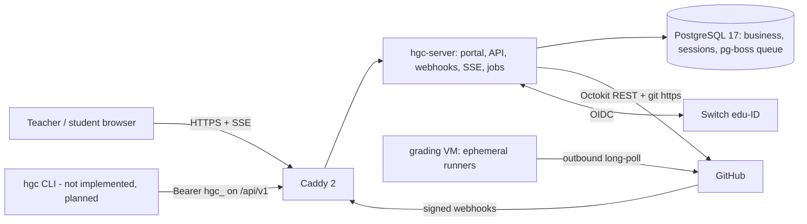

> Project: HEIG GitHub Classroom.
> Frame: `01-cahier-des-charges.md` (US/NFR/C, H1-H12 validated),
> `02-specs-fonctionnelles.md` (AU/GH/GR/CLI/NT).
> Status: consolidated architecture (final phase 3 edition), resulting from the cross review of three
> proposals (simplicity, productivity, robustness). Retained basis: **simplicity first**,
> enriched with the robustness and productivity mechanisms judged compatible. Every
> structuring decision is recorded in an ADR (section [Decisions](#sec:decisions), files
> `docs/adr/ADR-00x-*.md`).

# Overview and breakdown

## Guiding stance

One maintainer, one boring technology, a minimum of moving parts: every component must
justify itself against an NFR. The result is a **modular monolith** — a single Node.js process
serves the portal (static SPA), the APIs, the webhook endpoint, the SSE stream and runs the background
jobs — backed by a **single PostgreSQL database** that carries the business data, the sessions and the
job queue (no Redis, no broker, no orchestrator). See `ADR-001` and `ADR-003`.

Justification: low volumetry (NFR-11: ≤ 100 students × 20 classrooms), 99 % availability
(NFR-08) reachable with a supervised process, operating cost as a major criterion
(a team of one teacher). The bursts (webhooks at the deadline, mass pushes) are a **queueing**
problem, not a scalability one: the webhook endpoint acknowledges in less than 5 s (GH-60)
and the real work is absorbed by the database-backed queue with bounded concurrency.

A `WORKER_MODE` environment variable (borrowed from the productivity proposal) allows the
process to be split later into a `web` role and a `worker` role **without a code
change**: the evolution option is free, not paid for in advance.

Cross-cutting rule (borrowed from the robustness proposal, `ADR-011`): **every external event
is losable, every job is interruptible, every state is reconcilable**. Every
critical piece of information has two arrival paths: the webhook (nominal) and the periodic reconciliation
(backup), which **reuses the same idempotent handlers**.

## Components

| Component | Role | Hosting |
| --- | --- | --- |
| `hgc-server` (monolith) | Portal, portal API, v1 key-based API, webhooks, SSE, jobs and crons | Application VM, container |
| PostgreSQL 17 | Business data, sessions, job queue (pg-boss), webhook dedup, audit | Same VM, container |
| Caddy 2 | Reverse proxy, automatic TLS (Let's Encrypt), HSTS | Same VM, container |
| Grading runners | Ephemeral GitHub Actions runners (student code) | Separate dedicated VM |
| `hgc` CLI — **not implemented (planned)** | Client of the v1 API (npm package) | Teacher's machine |

## Internal modules of the monolith

Lightweight pnpm monorepo (workspaces, without Turborepo):

| Package | Role |
| --- | --- |
| `packages/domain` | **Pure** business rules, testable without mocks: GR-02 regex, GR-06 aggregation, GR-05 eligibility, GR-12/14 freeze computation |
| `packages/contracts` | Shared Zod schemas (API types front, back, CLI; single source of the contract) |
| `apps/server` | Fastify monolith: modules `auth`, `roster`, `assignments`, `github`, `provisioning`, `protected-files`, `deadline`, `grading`, `sync`, `metrics`, `notifications`, `api-v1`, `events`, `jobs` |
| `apps/web` | React SPA (teacher and student portal) |
| `apps/hgc` — **not implemented (planned)** | CLI (npm package) |

The boundaries are TypeScript modules with explicit interfaces; no network between them.
The `domain` package has no dependency on the framework or on the database: that is where the
rules with a high dispute stake (freeze, grades) live, exhaustively tested in phase 5.

## Diagram


```mermaid
flowchart LR
  B[Teacher / student browser] -->|HTTPS + SSE| C[Caddy 2]
  CLI["hgc CLI - not implemented, planned"] -->|Bearer hgc_ on /api/v1| C
  GH[GitHub] -->|signed webhooks| C
  C --> S[hgc-server: portal, API, webhooks, SSE, jobs]
  S --> PG[(PostgreSQL 17: business, sessions, pg-boss queue)]
  S -->|Octokit REST + git https| GH
  S <-->|OIDC| ID[Switch edu-ID]
  R[grading VM: ephemeral runners] -->|outbound long-poll| GH
```

The runners have **no** link with the platform: they only talk to GitHub (outbound
connection), the platform only reads the results (C-04). The runner VM knows neither the
database nor the platform API.

# Stack and justification

| Layer | Choice | Version | Justification against the NFRs |
| --- | --- | --- | --- |
| Runtime | Node.js LTS | 22.x | The most mature GitHub ecosystem (official Octokit); a single language front, back, CLI |
| Language | TypeScript strict | 5.x | Shared typing, safe refactoring by assistants |
| HTTP | Fastify (`@fastify/cookie`, `@fastify/rate-limit`, `@fastify/static`) | 5.x | Lightweight, native schemas, trivial SSE, no DI or decorators to debug at 11 pm (`ADR-002`) |
| GitHub client | Octokit (`octokit`, `@octokit/webhooks`, plugins `retry` + `throttling`) | 4.x / 13.x | Native backoff on primary and secondary rate limits (NFR-10, GH-63) |
| OIDC | `openid-client` (certified, Code + PKCE) | 6.x | AU-01: reference `state`, `nonce`, PKCE |
| Database | PostgreSQL | 17 | ACID, UNIQUE constraints as the idempotence mechanism, a single thing to back up (NFR-16) |
| DB access | Drizzle ORM + drizzle-kit | pinned | Close to SQL, versioned migrations; access isolated behind a repository layer (pre-1.0 risk mitigated, `ADR-003`) |
| Jobs and cron | pg-boss (job queue on Postgres) | 10.x | Exponential retries, cron, singleton keys (NFR-09), retention; removes Redis (`ADR-004`) |
| Validation | Zod (schemas shared front, back, CLI) | 4.x | Single contract, generated OpenAPI |
| Front | React + Vite, TanStack Router + Query, TanStack Table, Radix UI (headless), i18next, Luxon | React 19, Vite 7 | Static SPA without SSR (`ADR-008`); Radix covers keyboard and ARIA (NFR-15); externalized strings (NFR-14); Europe/Zurich (C-02) |
| CLI | npm package `hgc` (commander + typed v1 client) — **not implemented (planned)** | — | H7, CLI-01..04 |
| Proxy | Caddy | 2.x | Auto TLS, HSTS, a 15-line configuration |
| Observability | pino (AU-41 redaction), `/healthz`, `/metrics` Prometheus, external probe 60 s | — | NFR-08; requirement-driven metrics (section [Deployment](#sec:deployment)) |

Negative justifications, systematic (each non-choice is an avoided operating cost):

- **No NestJS**: a DI and decorator overlay is not indispensable for about thirty
  endpoints; the systematic authorization (AU-24) is an explicit Fastify middleware.
- **No Redis or BullMQ**: pg-boss covers the need (less than 10 jobs/s in the worst burst) without
  a second stateful component to back up and supervise.
- **No SSR or Next.js**: authenticated portal, SEO is moot; the front is a folder of
  static files.
- **No session JWT**: server-side invalidation required by AU-06; one table is enough.
- **No Kubernetes, microservices or broker**: nothing in the NFRs justifies them.

In development, a test OIDC IdP (Keycloak or mock) replaces Switch edu-ID behind
`openid-client`: the institutional registration process does not block milestone M1.

# Database schema

UTC everywhere (`timestamptz`), Europe/Zurich conversion at display time (C-02). `uuid` v7 PK (temporal
ordering) unless stated otherwise. Key columns only:

```text
users            id, oidc_sub UNIQUE NOT NULL, email, email_verified, given_name,
                 family_name, swiss_edu_id NULL, role (student|teacher),
                 github_user_id bigint UNIQUE NULL (AU-10), github_login,
                 github_linked_at, last_login_at (AU-27),
                 anonymized_at NULL (LPD), created_at

sessions         sid_hash char(64) PK,        -- SHA-256 of the session token (never in clear text)
                 user_id FK, expires_at, created_at
                 INDEX (expires_at)

organizations    id, github_org_id bigint UNIQUE, login,
                 installation_id bigint UNIQUE NULL, status (active|degraded) (GH-06)

classrooms       id, org_id FK, teacher_id FK users, name, created_at

enrollments      id, classroom_id FK, nom, prenom, email (normalized),
                 status (pending|claimed), user_id FK NULL, claimed_at,
                 conflict_flag bool (AU-21)
                 UNIQUE(classroom_id, email) ; UNIQUE(classroom_id, user_id)
                 INDEX (lower(email))                  -- claim at login (AU-18/19)

assignments      id, classroom_id FK, name, slug, state (draft|published|locked),
                 start_at, deadline_at, grace_minutes DEFAULT 30,
                 source_repo_id bigint, source_full_name,
                 squashed_repo_id bigint, squashed_full_name,
                 source_strategy (whole|squash), deadline_strategy (lock|commit),
                 branches text[], protected_files text[],
                 source_ahead_sha NULL (GH-50), deadline_applied_at NULL,
                 frozen_at NULL
                 INDEX (deadline_at) WHERE state='published'
                       AND deadline_applied_at IS NULL       -- deadline ticker scan
                 INDEX (deadline_at) WHERE deadline_applied_at IS NOT NULL
                       AND frozen_at IS NULL                  -- freeze after grace period

primary_commits  id, assignment_id FK, branch, squashed_sha char(40),
                 source_sha char(40), created_at       -- GH-13.3 mapping

student_repos    id, assignment_id FK, user_id FK, github_repo_id bigint UNIQUE NULL,
                 full_name, default_branch, provision_status (pending|ok|error),
                 accepted_at, invitation_id bigint NULL,
                 invitation_status (pending|accepted|expired),
                 last_reinvite_at (GH-24), locked_at NULL, ruleset_id bigint NULL,
                 archived_fallback bool (H8), protected_conflict bool (GH-33/35),
                 last_commit_sha, last_commit_at, ci_status (none|pending|pass|fail),
                 current_grade_run_id FK NULL,
                 frozen_grade_run_id FK NULL, frozen_final bool DEFAULT false
                 UNIQUE(assignment_id, user_id)        -- GH-20 idempotence key

push_receipts    id, student_repo_id FK, branch, head_sha char(40),
                 received_at NOT NULL,                 -- server time = freeze reference
                 is_bot bool, forced bool (GH-22)
                 UNIQUE(student_repo_id, head_sha)     -- GR-14, O(1) resolution at freeze time

bot_commits      student_repo_id FK, sha char(40), kind (revert|deadline|sync)
                 PK(student_repo_id, sha)              -- deterministic GR-05/GH-44 filter

grade_runs       id, student_repo_id FK, workflow_run_id bigint, run_attempt int,
                 head_branch, head_sha, conclusion, grade_points numeric NULL,
                 grade_max numeric NULL,
                 parse_status (ok|no_annotation|malformed|multiple|fallback),
                 after_deadline bool, completed_at, created_at   -- immutable (GR-08)
                 UNIQUE(student_repo_id, workflow_run_id, run_attempt)
                 INDEX (student_repo_id, completed_at DESC)
                       WHERE after_deadline = false    -- current grade GR-09

reverts          id, student_repo_id FK, revert_sha, files text[], created_at
                 INDEX (student_repo_id, created_at)   -- ceiling of 5/h (GH-33, H10)

sync_batches     id, assignment_id FK, source_sha, started_at, finished_at,
                 summary jsonb                         -- US-06 summary

sync_prs         id, sync_batch_id FK, student_repo_id FK, pr_number int,
                 state (open|merged|closed|conflict), source_sha, updated_at
                 UNIQUE(student_repo_id, pr_number)

api_keys         id, teacher_id FK, label, key_prefix char(12), key_hash char(64),
                 scopes text[], classroom_ids uuid[] NULL ('*'=NULL),
                 expires_at, last_used_at, revoked_at NULL     (AU-30)
                 INDEX (key_prefix)

notifications    id, user_id FK, type, payload jsonb, read_at NULL, emailed_at NULL,
                 created_at
                 INDEX (user_id, read_at)

audit_log        id bigserial, actor_user_id NULL, actor_type (user|system|api_key),
                 action, subject_type, subject_id, payload jsonb, created_at
                 -- append-only: application SQL role WITHOUT UPDATE/DELETE on this
                 -- table; only the NFR-07 pseudonymization routine (dedicated role)
                 -- may rewrite the identity fields

webhook_deliveries delivery_id uuid PK (X-GitHub-Delivery), event, action,
                 payload jsonb,                        -- diagnostics, purge > 30 d
                 received_at, processed_at NULL, error text NULL
                 INDEX (received_at) WHERE processed_at IS NULL   -- lateness metric

(+ pgboss.* schema managed by pg-boss)
```

Salient points:

1. The UNIQUE constraints **are** the idempotence mechanism: a replay (duplicated webhook, job
   re-run) ends in `ON CONFLICT DO NOTHING`, never in a duplicate (NFR-09).
2. `push_receipts.received_at` is written **synchronously** in the webhook handler: the reception
   time (the legally decisive datum of the freeze, GR-14/H6) never depends on the lateness of the queue
   (`ADR-012`).
3. `sessions` only stores a **hash** of the token (productivity borrowing): a leak of the table does
   not allow a session to be replayed.
4. The webhook payloads are kept for 30 days for the diagnosis of deadline disputes
   (robustness borrowing), then purged by cron; purpose and duration are documented in the
   LPD register.
5. C-01 compliance: `student_repos.last_*` and `ci_status` are caches rebuildable
   from GitHub; `users`, `enrollments`, `assignments`, `api_keys`, `grade_runs`,
   `audit_log` and the freezes are the source of truth, hence the NFR-16 backup perimeter.

# GitHub architecture

## GitHub App and tokens

- A single GitHub App (GH-01), permissions strictly those of the GH-02 table — **no
  additional organization permission** (the registration of the runners happens outside the App,
  see the section [Deployment](#sec:deployment) and `ADR-007`). Creation by **manifest flow**
  (reproducible configuration).
- Authentication: JWT (PEM private key, ≤ 10 min) → installation token (1 h). In-memory
  cache per `installation_id`, renewal at T−10 min (GH-03), natively handled by
  `@octokit/auth-app`. Never persisted in the database, never exposed to the front. Git pushes via
  `https://x-access-token:<token>@github.com/...`.
- A single process, therefore no distributed cache to synchronize.
- Centralized client (module `github`) with the `throttling` and `retry` plugins: automatic backoff
  on primary and secondary 403, then failure of the job taken up by pg-boss with exponential backoff —
  the work is never lost (GH-63, NFR-10). Every GitHub **mutation** (repository, operation,
  SHA before and after) is logged in `audit_log`.
- Private key rotation: GitHub accepts two active keys simultaneously; the procedure
  (generation, switch-over, revocation) is in the runbook (`ADR-010`).
- Quota budget: 5,000 req/h per installation. Worst case measured (deadline over 100 repositories:
  3 to 4 requests per repository, that is about 400): a margin of a factor of 10.

## Webhooks: reception, deduplication, queue

`POST /webhooks/github` (GH-60):

1. HMAC `X-Hub-Signature-256` verification (`@octokit/webhooks`, constant-time comparison);
   401 rejection counted (NFR-04).
2. Deduplication: `INSERT ... ON CONFLICT DO NOTHING` on `webhook_deliveries(delivery_id)`;
   duplicate = immediate 200.
3. For a `push` on a `student_repo`: **synchronous** write of `push_receipts` — the server
   reception time is the freeze reference (GR-14) and must not depend on the queue.
4. pg-boss enqueueing (`webhook.push`, `webhook.workflow_run`, `webhook.pull_request`,
   `webhook.installation`, `webhook.repository`), then **200 in less than 5 s** (measured: less
   than 100 ms). Everything else (protected files compare, grade extraction, synchronization PR) is
   asynchronous.

Deadline burst (100 pushes + 100 `workflow_run` in a few minutes): the ingestion costs
two INSERTs; the drain happens at bounded concurrency (10 workers per job type) without ever
threatening the acknowledgement. Handler failure: 5 attempts with exponential backoff, then
**dead-letter** visible in the technical administration screen (robustness borrowing) with a log
alert.

## Idempotence

- **Provisioning**: pg-boss singleton job with key `assignment_id:user_id` +
  `UNIQUE(assignment_id, user_id)`; each step checks the state before acting (does the repo exist?
  does the invitation exist? is the ruleset set?) — resumption without duplicates (GH-20, NFR-09). The sending
  throughput of the invitations is bounded by a **configurable rate limiter** (plan B C-07.3: automatic
  spreading if the quota measured in S2 is lower than the headcount).
- **GradeRuns**: `UNIQUE(repo, run_id, run_attempt)` (GR-05.4).
- **Deadline**: `deadline_applied_at` + `locked_at` and `bot_commits` per repository — re-execution
  without double application (US-22).
- **Reverts**: **non-forced fast-forward** ref update; a race fails cleanly and the
  next webhook re-triggers it (GH-34).

## Jobs, deadline to the minute, catch-up

**No scheduled one-shot job** (fragile if the deadline is modified or the process is stopped). A
**single ticker** acts as the guarantee (`ADR-006`):

1. Every **20 s** (in-process, protected by a Postgres advisory lock — safe even in the case of a
   `WORKER_MODE` split), it executes: `SELECT ... FROM assignments WHERE state='published'
   AND deadline_at <= now() AND deadline_applied_at IS NULL`, then enqueues a
   `deadline.apply(assignment)` job (singleton). Start ≤ 60 s guaranteed (NFR-13);
   **rescheduling** (US-08, GH-43) free of charge (the ticker re-reads the table); **catch-up after
   an outage** of any duration free of charge (the condition stays true), without double application.
2. `deadline.apply` fans out into per-repository jobs (concurrency 10; 1 to 2 API calls per repository,
   so 100 repositories are well below 5 min). `lock` strategy: lock branch ruleset, App and
   Org admin bypass (GH-41), archiving fallback reported (H8); `commit` strategy: empty bot commit per
   branch, SHAs recorded in `bot_commits` (GH-42/44). The individual failures stay in
   retry without blocking the other repositories.
3. **Two-stage freeze** (productivity borrowing, literal reading of GR-12/14.4, `ADR-012`):
   when the deadline is applied, `frozen_grade_run_id` is set **provisionally** (current
   grade GR-09 at that instant). During the grace period, only the runs bearing on
   commits **received before the deadline** (`push_receipts`) can still improve it. The freeze
   ticker (same mechanism, scan on `frozen_at IS NULL`) sets `frozen_at` and `frozen_final` at
   `deadline + grace_minutes`: the frozen grade becomes definitive and immutable.
4. Timezone: deadlines entered in Europe/Zurich, converted to UTC via Luxon at write time (the
   daylight saving changes are resolved at entry time); the ticker compares UTC instants (C-02).

## Periodic reconciliation (the backup polling)

Structuring rule (`ADR-011`): the reconciliation **reuses the same idempotent handlers
as the webhooks** — a single state-update code path, two trigger sources. It is
also the recovery plan after a restore (NFR-16).

| pg-boss cron | Period | Role |
| --- | --- | --- |
| `reconcile.grades` | 15 min | GR-07: re-queries the runs of the repositories without a webhook for more than 30 min |
| `reconcile.repos` | 24 h | Head SHA of the branches vs database; expired invitations, re-invitation ≤ 1/24 h (GH-24) |
| `reconcile.deliveries` | 24 h | `GET /app/hook/deliveries`: failed deliveries, API redelivery (GH-62) |
| `notify.email` | continuous | Sending of opt-in e-mails with retries (NT-02, NFR-17) |
| `purge.housekeeping` | 24 h | Purge of expired sessions, webhook payloads > 30 d, pg-boss archives |

The periods above are **default values**: they are configurable on the fly
from the admin screen (`scheduled_tasks` table — period, activation, manual execution,
state of the last run). The ticker re-reads the table at each round; a period change
takes effect without a restart. The tasks whose domain is also covered by the webhooks
are marked "webhook-woken" in the UI: the incoming event is processed immediately,
the scheduling is only the safety net. `reconcile.grades` arrives with M5, `notify.email`
with the notifications (NT-02).

# Real time: SSE

**Choice: Server-Sent Events, not WebSocket** (`ADR-005`).

- The need is strictly **unidirectional** (CI status, grade, notifications towards the
  browser; GR-10, NT-01). The upstream channel already exists: REST.
- SSE is plain HTTP: AU-06 session cookies reused as they are, native automatic
  reconnection (`EventSource`), traversal of Caddy with `flush_interval -1` on the route,
  testable with `curl`.
- WebSocket would bring useless bidirectionality, a server library and dedicated
  ping-pong and authentication handling — operating code for nothing.

Implementation: `GET /app/events` endpoint (session required), **outside** the `/api/v1` surface
which stays reserved to the key-based API (correction of a confusion noted in review). In-process bus
(EventEmitter) fed by the modules; filtering by authorization (a student only receives
their repositories, AU-26). **Deliberately simple resumption**: no `Last-Event-ID` replay or ring
buffer to maintain — on (re)connection, the front re-issues its TanStack Query requests. Heartbeat
`:ping` every 25 s. Degradation: without SSE, periodic refetch at 30 s — no functional
requirement depends on real time. Volume: about 200 simultaneous connections at most,
trivial for a Node process. If `WORKER_MODE` one day splits the roles, the relay goes through
Postgres `LISTEN/NOTIFY` — still without Redis.

# API contract

Two surfaces, the same process, strict separation of the authentication planes:

| | Portal API | Key-based API (CLI `hgc`) |
| --- | --- | --- |
| Base | `/app/api/...` (+ `/app/events` for SSE) | `/api/v1/...` |
| Style | REST JSON, unversioned (coupled to the front, deployed together) | REST JSON, versioned by URI (`v1`), stable contract; breaking = `v2`, `v1` maintained for one semester |
| Auth | Session cookie `HttpOnly Secure SameSite=Lax`, 12 h, hash in the database (AU-06) | `Authorization: Bearer hgc_...` (AU-34) |
| Anti-CSRF | SameSite=Lax **and** double-submit token (readable cookie + `X-CSRF-Token` header) required on every mutation | Moot (no cookie) |
| Permissions | Roles and ownership re-checked server-side on every request (AU-23/24) through a systematic middleware | Read-only, scopes `classrooms:read` / `repos:read` (AU-31), perimeter = the teacher's classrooms (AU-33) |
| Errors | JSON `{error, message}` | 401/403/404 according to AU-34 (404 indistinguishable from out-of-perimeter), 429 + `Retry-After` (AU-39) |
| Format | — | `{data, pagination}` envelope (AU-35), explicit nullables (AU-36) |

Shared Zod schemas (`packages/contracts`): input validation, front and CLI types,
OpenAPI 3.1 generation (`@fastify/swagger`) for `/api/v1`. Rate limiting `@fastify/rate-limit`:
120 req/min per key; OIDC/OAuth callbacks and claim limited by IP (AU-39). The `hgc` CLI
(CLI-01..04) consumes the generated typed client; clone with the teacher's own git credentials
(AU-37), parallelism bounded to 4.

# Security

- **Tokens**: no user token persisted — the GitHub OAuth token is discarded after the identity
  has been read (AU-09, NFR-02, C-06); OIDC tokens never exposed to the front; installation
  tokens in memory only (GH-03).
- **Sessions**: 256-bit random token, only the **SHA-256 is stored** in the database; server-side
  invalidation (AU-06).
- **API keys**: `hgc_` + 40 CSPRNG characters; storage of `key_prefix` + SHA-256; lookup by
  indexed prefix then constant-time comparison (`crypto.timingSafeEqual`); revocation and
  expiration = immediate 401 (AU-30/32/38).
- **Server secrets** (`ADR-010`): OIDC and GitHub client secrets, webhook secret, PEM key of
  the App, cookie secret — environment files on the VM, owner root, permissions 600,
  **outside the repository and outside the database** (strict reading of AU-43: never in a git repository, even
  encrypted). **age-encrypted** backup copy in the institutional vault (HEIG Vaultwarden
  or equivalent) for the restore runbook. Documented rotation (two active PEM keys
  during the switch-over).
- **Logs**: systematic masking through dedicated pino serializers — keys beyond the prefix, OAuth
  `code`, cookies, `Authorization` headers (AU-41).
- **Audit**: `audit_log` append-only **at the database level**: the SQL role of the application has neither
  `UPDATE` nor `DELETE` on this table (NFR-05); only the pseudonymization routine (dedicated SQL
  role) may rewrite the identity fields (NFR-07). AU-42 events written in the same
  transaction as the action.
- **LPD (H11, NFR-07)**: deletion on request = anonymization transaction — in `users`
  and `enrollments`, the personal fields **including `oidc_sub`** (pivot identifier, productivity
  borrowing) are replaced by `anon-<shortid>`, `github_*` erased, `anonymized_at` set;
  GradeRuns and metrics kept attached to the pseudonym; `audit_log` pseudonymized by the
  same routine; removal of the GitHub collaborator access, repositories not deleted. Hosting and
  backups **in Switzerland** (HEIG VM, SWITCH storage): no question of cross-border
  transfer.
- **GitHub perimeter**: minimal App permissions (GH-02), students never admin (GH-23),
  identified bot commits (C-05), no student code executed by the platform (C-04 — the only
  place where it executes outside GitHub is the runner VM, which is isolated).
- **Webhooks**: mandatory HMAC, rejections counted (NFR-04); HTTPS + HSTS everywhere (AU-38).

# Deployment {#sec:deployment}

## Application VM

One VM (4 vCPU / 8 GB / 60 GB, Debian stable, HEIG hosting — data in Switzerland), Docker
Compose, three services (`ADR-009`):

```yaml
services:
  caddy:    # auto TLS, HSTS, reverse proxy to app; only exposed port (443)
  app:      # hgc-server (single image, built front included), restart: always
  postgres: # postgres:17, local volume, not exposed
```

- **Webhooks**: public URL `https://classroom.<domain>/webhooks/github` — a route of
  the monolith behind Caddy. In dev: `smee.io` or `cloudflared tunnel`.
- **Deployment**: `docker compose pull && docker compose up -d`; Drizzle migrations at
  startup (with a lock); image versioned by git tag; rollback = previous tag.
- **Availability**: `restart: always` + `/healthz` healthcheck (DB, pg-boss, clock), external
  probe at 60 s (NFR-08, Uptime-Kuma or institutional probe). An unavailability does not prevent
  the students from working (GitHub repositories accessible) and the missed webhooks are
  re-delivered then reconciled (GH-62). The single-process SPOF is **accepted**; `WORKER_MODE`
  remains the emergency exit without a redesign.

## Requirement-driven observability

`/metrics` endpoint (Prometheus) exposing, in addition to the process metrics (robustness borrowing):

1. Age of the oldest unprocessed webhook (`webhook_deliveries WHERE processed_at IS NULL`) —
   the indicator of the deadline bursts.
2. Depth and lag of the pg-boss queue, jobs in dead-letter.
3. Remaining GitHub quota per installation.
4. Lateness of the deadline ticker (last run).

A minimal technical administration screen (reserved to the operating teacher role) lists the jobs
in dead-letter with manual re-run — the 11 pm diagnosis is not done in raw SQL.

## Self-hosted runner for the grading — decision

**Settled: yes, a self-hosted runner dedicated to the grading, in ephemeral mode, on a separate VM**
(`ADR-007`).

**Why.** 3,000 min/month (Team plan) do not hold: low-end assumption 100 students ×
20 runs/month × 2.5 min = 5,000 min, with much worse peaks in submission weeks. The
paid overage would require a card and a spending limit, and would expose the project to a grading
outage in the middle of a due date; a HEIG VM is available and free. The 3,000 hosted minutes
remain for the source repositories and the teacher's CI.

**Sizing driven by the freeze** (robustness borrowing, GR-14.4). The runs bearing on
commits received before the deadline must finish within the grace period, otherwise they are
excluded from the frozen grade. Required capacity:

$$
N_{slots} \ge \frac{N_{runs} \times d_{run}}{grace}
$$

Worst case: 100 nearly simultaneous runs × 3 min / 30 min of grace = 10 slots. Combined decision:

1. Dedicated runner VM 8 vCPU / 16 GB / 100 GB, **8 concurrent ephemeral runners** (1 vCPU /
   2 GB each), confirmed in S3.
2. `grace_minutes` configurable per assignment (default 30 min, in line with H6); at creation time,
   the portal **recommends 60 min** as soon as `headcount × typical-duration / grace` exceeds the capacity
   (in practice: classes of more than 60 students). At 60 min of grace, the worst case requires
   only 5 slots — a margin greater than a factor of 1.5.

**Runner registration — settled mechanism** (correction of a contradiction noted in
review: GH-02 forbids any additional organization permission, therefore **not** through the GitHub
App).

1. A dedicated **fine-grained PAT**, organization scope, sole permission "Self-hosted runners:
   read & write", held by the operator, stored only on the **host** of the runner VM
   (root, 600), 12-month expiration, rotation in the runbook.
2. A systemd supervisor on the host generates a **JIT configuration**
   (`POST /orgs/{org}/actions/runners/generate-jitconfig`) per job and launches a disposable container
   (`--ephemeral`); the job containers **never see** the PAT or any secret.
3. The runners are registered in an **organization runner group** whose visibility is
   "all private repositories": the dynamically created student repositories are covered without an
   API call per provisioning (the organization is dedicated to teaching). Label `grading`.
4. The `grading.yml` template (GR-03) uses `runs-on: [self-hosted, grading]` and the anti-bot
   condition `if: github.actor != '<app-slug>[bot]'` (GH-44) — the bursts of deadline commits
   are skipped without consuming a runner.

**Security (student code is hostile by definition).** Ephemeral runners (one job, one
destroyed container), unprivileged containers, immutable image (course toolchain) rebuilt
by CI, VM outside the internal HEIG network, filtered egress (GitHub and package mirrors only),
no organization secret exposed, no access to the application VM or to the database — the GR-02
annotation convention requires **no token** in `grading.yml`, the blast radius is nearly nil.
Monthly patching of the image.

**Two-step plan B, documented.** If the runner VM dies: the grading stops but nothing
else (the students work, the push metrics continue, the freeze is based on
`push_receipts`, insensitive to lateness).

1. Scripted rebuild of the VM in less than an hour.
2. As a last resort: GitHub spending limit + synchronization PR changing `runs-on` to
   `ubuntu-latest` — paid degradation rather than an outage.

## Backups (NFR-16)

- Daily `pg_dump -Fc` (02:00) through a sidecar cron container, copy **off the VM** to the Swiss
  institutional object storage (SWITCH or HEIG, encrypted rclone), 30-day retention. RPO ≤ 24 h.
- Restore runbook (RTO ≤ 4 h): fresh VM → clone the infra repository → restore the
  environment files and the PEM key from the institutional vault → `compose up` →
  `pg_restore` → re-point the DNS → launch the GH-62 reconciliation. The reconciliation crons
  absorb the lost window by themselves: **the idempotent design is the recovery plan**.
- **Timed restore test once per semester** (RTO validation, NFR-16
  requirement), recorded.

# Spikes S1-S3

Carried out on a sandbox organization with the dev GitHub App, before or during M2-M5. Each
spike produces a reusable TypeScript script and feeds the ADRs.

| Spike | Must prove | Exit criteria |
| --- | --- | --- |
| **S1 — Protected files revert** (before M3) | GH-32 algorithm (Git Data: HEAD tree + reference blobs, bot commit, fast-forward ref update) | Correct revert for modification, deletion and renaming; bot push ignored (no loop); "student push during revert" race: the update fails cleanly and the next webhook catches up; 6th revert within the hour = suspension (H10); webhook → revert latency < 60 s (NFR-12) measured |
| **S2 — App provisioning** (before M2, lifts C-07.3) | Full chain: App by manifest, installation, token, repo creation + squashed refs push + invitation + ruleset | 30 consecutive provisionings without a 403 secondary rate limit, each < 60 s; ruleset verified with a **real student account** (force push refused) **and** a teacher org admin account (write bypass despite the lock, GH-41); lock ruleset set and then removed by the App; **invitation quota/24 h measured and documented** (C-07.3), throughput of the invitation rate limiter calibrated; idempotence: replaying the job halfway creates neither a duplicate repo nor a duplicate invitation |
| **S3 — Grading chain** (before M5, measurements required before M4 by GH-44.3) | `grading.yml` on an ephemeral self-hosted runner → `GRADE` annotation → `workflow_run` webhook → check-runs API → GR-02 parse | Grade extracted < 2 min after the end of a run (NFR-12); ephemeral runner recycled on its own after each job, JIT registration by PAT validated; anti-bot condition: bot commit skipped without occupying a runner; GR-17 edge cases replayed (absent, malformed, multiple annotation, failed run); the student job cannot read any secret or reach the application VM; minute consumption and duration of a typical run measured, 8-slot sizing confirmed |

# Milestones M1-M7 (phase 4)

| Milestone | Content | Depends on |
| --- | --- | --- |
| **M1 — Foundation + auth + classrooms** | Monorepo, CI, deployed compose (Caddy + app + PG), migrations, `/healthz`, `/metrics`, **backups active from this milestone on**; edu-ID OIDC (test IdP in dev) + sessions + roles (AU-01..07); GitHub linking (AU-08..12); classroom CRUD; roster import and claim + conflicts (AU-13..22); audit | Switch edu-ID client registration process started immediately |
| **M2 — Assignments + provisioning** | App installation, life cycle (GH-04..06); assignment creation, squashed whole and squash, `primary_commits` (GH-10..15); US-08 states; acceptance + idempotent provisioning + ruleset + invitations with rate limiter (GH-20..25) | M1, **S2**, Education seats confirmed (C-07.2) |
| **M3 — Webhooks + metrics + protected files** | Webhook endpoint + dedup + queue + dead-letter; synchronous `push_receipts`; metrics (GR-15); protected files revert + ceiling + conflict (GH-30..35); SSE; notification center (NT-01/03); daily reconciliation (GH-62) | M2, **S1** |
| **M4 — Deadline** | Ticker + `deadline.apply` jobs and provisional freeze, lock ruleset + archiving fallback, deadline commit, post-outage catch-up demonstrated, rescheduling (GH-40..44) | M3 (`bot_commits`, receipts); S3 measurements (GH-44.3) |
| **M5 — Grading** | GR-04..09 pipeline, GR-17 edge cases, GR-12..14 definitive freeze, student and teacher grade views (GR-10/11); **runner VM in production** | M3, M4 (freeze), **S3** |
| **M6 — PR synchronization** | Detection of source getting ahead, squashed update, reused bot PRs, tracking through `pull_request`, summary (GH-50..53) | M2 (squashed), M3 (webhooks) |
| **M7 — API v1 + CLI + finishing touches** | API keys (AU-29..40), AU-34..36 endpoints, `hgc` CLI (CLI-01..04); opt-in e-mail (NT-02); LPD anonymization (NFR-07); axe-core accessibility audit (NFR-15); timed restore test; acceptance | M5 (grades exposed), M2 (repos) |

M6 and M7 can be parallelized after M5. Critical path: M1 → M2 → M3 → M4 → M5. Major external
risk at the head of the chain: the registration of the Switch edu-ID client (mitigated by the test IdP).
A real pilot on a small class is recommended after M5.

# Residual technical risks

| Risk | Impact | Mitigation |
| --- | --- | --- |
| GitHub secondary rate limits on mutation bursts (100 repos, rulesets, synchronization PRs) | Provisioning or deadline slowed down | Octokit throttling plugin + bounded concurrency (10) + pg-boss resumption; budgets measured in S2; NFR-13 keeps a 5 min margin; the ticker guarantees completion even if spread out |
| Unknown org invitation quota/24 h (C-07.3) | Blocking of a class of 100 at acceptance time | Measurement in S2; invitation rate limiter with a configurable throughput; plan B: org members with `none` permission |
| Registration of the Switch edu-ID OIDC client (institutional procedure) | M1 delay | Request started immediately; dev on a test IdP (Keycloak) — `openid-client` makes the exchange transparent |
| Runner VM: hostile student code (container escape, mining, network abuse) | Compromise of the grading VM only | Ephemeral + unprivileged + immutable image + isolated VM with no secret or platform access + filtered egress; blast radius nearly nil; scripted rebuild; monthly patching; residual risk accepted and documented |
| Runner VM unavailable during a submission period | Late grades (no loss: freeze based on `push_receipts`, re-runs possible) | Supervision of the runner host, rebuild < 1 h, GR-07 reconciliation; plan B `ubuntu-latest` + spending limit; adjustable grace period |
| Deadline burst: 100 simultaneous runs | Processing latency | 8-slot sizing derived from the freeze (GR-14.4) + 60 min grace recommendation; webhook ack < 100 ms + persistent queue: lateness, never loss; "age of the oldest webhook" metric alerted |
| Single-process SPOF | Occasional unavailability of the portal | Accepted (NFR-08 = 99 %): auto restart, webhooks re-delivered (GH-62), the ticker catches up the deadlines (NFR-09); the students' work on GitHub is never blocked; `WORKER_MODE` as the emergency exit |
| SSE cut by proxies or timeout | Degraded live view | 25 s heartbeat, Caddy `flush_interval -1`, EventSource reconnection + refetch — degradation to polling, never to data loss |
| Leak of the GitHub App private key | Control of the installed orgs | PEM outside the repository, 600, age-encrypted copy in the vault; rotation with two active keys; immediate revocation documented in the runbook |
| Leak of the runner registration PAT | Registration of rogue runners in the org | Minimal scope (runners only), stored on the runner host alone, 12-month expiration, immediate revocation, rotation in the runbook |
| Drizzle pre-1.0: ORM API migrations | Targeted rework | Pinned versions, database access isolated behind a repository layer; a switch to Kysely is possible without touching the domain |
| Drift of the GitHub API (rulesets, annotations, Education plans) | Silent breakage of a flow | Pinned Octokit versions, centralized client (a single module to adapt), daily reconciliation as a safety net, integration tests against a sandbox org in CI |
| Growth of `webhook_deliveries` and `push_receipts` | DB volumetry | Purge of payloads > 30 d (cron); volumetry of no consequence at this scale |

# Decisions {#sec:decisions}

Every structuring decision is recorded in a short ADR (status, context, decision,
consequences, rejected alternatives), versioned in `docs/adr/`.

| ADR | Decision | File |
| --- | --- | --- |
| ADR-001 | Modular monolith, single process, `WORKER_MODE` split as an option | `ADR-001-monolithe-modulaire.md` |
| ADR-002 | Node.js + TypeScript + Fastify backend (NestJS ruled out) | `ADR-002-stack-backend-fastify.md` |
| ADR-003 | PostgreSQL as the only stateful component, Drizzle ORM isolated | `ADR-003-postgresql-drizzle.md` |
| ADR-004 | pg-boss job queue on Postgres (Redis/BullMQ ruled out) | `ADR-004-jobs-pg-boss.md` |
| ADR-005 | SSE rather than WebSocket, without `Last-Event-ID` replay | `ADR-005-sse-sans-websocket.md` |
| ADR-006 | Deadline through a single ticker-sweeper (no one-shot job) | `ADR-006-deadline-ticker.md` |
| ADR-007 | Ephemeral self-hosted runners sized by the freeze, JIT registration by PAT outside the App | `ADR-007-runner-self-hosted.md` |
| ADR-008 | React + Vite SPA front, headless Radix, without SSR | `ADR-008-frontend-spa-react.md` |
| ADR-009 | Single-VM deployment with Docker Compose + Caddy | `ADR-009-deploiement-vm-compose.md` |
| ADR-010 | Secrets outside the repository and outside the database, encrypted institutional vault | `ADR-010-stockage-secrets.md` |
| ADR-011 | Reconciliation reusing the idempotent webhook handlers | `ADR-011-reconciliation-handlers.md` |
| ADR-012 | Grade freeze: synchronous reception time, two-stage freeze | `ADR-012-gel-note-deux-temps.md` |
| ADR-013 | Online workspace: no student credential, therefore no write access | `ADR-013-environnement-en-ligne.md` |
| ADR-014 | Group assignments: groups per assignment, formed by the staff, three lots | `ADR-014-group-assignments.md` |
