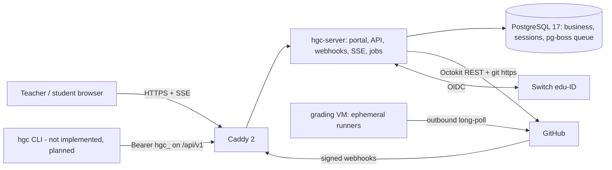

> Projet : HEIG GitHub Classroom.
> Cadre : `01-cahier-des-charges.md` (US/NFR/C, H1-H12 validées),
> `02-specs-fonctionnelles.md` (AU/GH/GR/CLI/NT).
> Statut : architecture consolidée (édition finale de la phase 3), issue de la revue croisée de trois
> propositions (simplicité, productivité, robustesse). Base retenue : **la simplicité d'abord**,
> enrichie des mécanismes de robustesse et de productivité jugés compatibles. Chaque
> décision structurante est consignée dans une décision d'architecture (section [Décisions](#sec:decisions), fichiers
> `docs/adr/ADR-00x-*.md`).

# Vue d'ensemble et découpage

## Posture directrice

Un seul mainteneur, une technologie ennuyeuse, un minimum de pièces mobiles : chaque composant doit
se justifier face à une NFR. Le résultat est un **monolithe modulaire** — un unique processus Node.js
sert le portail (SPA statique), les API, le point d'entrée des webhooks, le flux SSE et exécute les tâches
de fond — adossé à une **base PostgreSQL unique** qui porte les données métier, les sessions et la
file de tâches (pas de Redis, pas de broker, pas d'orchestrateur). Voir `ADR-001` et `ADR-003`.

Justification : volumétrie faible (NFR-11 : ≤ 100 étudiants × 20 classes), disponibilité de 99 %
(NFR-08) atteignable avec un processus supervisé, coût d'exploitation comme critère majeur
(une équipe d'un seul enseignant). Les rafales (webhooks au délai de rendu, push massifs) sont un
problème de **mise en file**, non de montée en charge : le point d'entrée des webhooks acquitte en moins de 5 s (GH-60)
et le travail réel est absorbé par la file adossée à la base, à concurrence bornée.

Une variable d'environnement `WORKER_MODE` (empruntée à la proposition productivité) permet de
scinder plus tard le processus en un rôle `web` et un rôle `worker` **sans changement de
code** : l'option d'évolution est gratuite, elle n'est pas payée à l'avance.

Règle transversale (empruntée à la proposition robustesse, `ADR-011`) : **tout événement externe
est perdable, toute tâche est interruptible, tout état est réconciliable**. Chaque
information critique dispose de deux chemins d'arrivée : le webhook (nominal) et la réconciliation périodique
(secours), qui **réutilise les mêmes gestionnaires idempotents**.

## Composants

| Composant | Rôle | Hébergement |
| --- | --- | --- |
| `hgc-server` (monolithe) | Portail, API du portail, API v1 par clé, webhooks, SSE, tâches et crons | VM applicative, conteneur |
| PostgreSQL 17 | Données métier, sessions, file de tâches (pg-boss), déduplication des webhooks, audit | Même VM, conteneur |
| Caddy 2 | Reverse proxy, TLS automatique (Let's Encrypt), HSTS | Même VM, conteneur |
| Runners de notation | Runners GitHub Actions éphémères (code étudiant) | VM dédiée séparée |
| CLI `hgc` — **non implémentée (prévue)** | Client de l'API v1 (paquet npm) | Machine de l'enseignant |

## Modules internes du monolithe

Monorepo pnpm léger (workspaces, sans Turborepo) :

| Paquet | Rôle |
| --- | --- |
| `packages/domain` | Règles métier **pures**, testables sans mocks : regex GR-02, agrégation GR-06, éligibilité GR-05, calcul du gel GR-12/14 |
| `packages/contracts` | Schémas Zod partagés (types d'API front, back, CLI ; source unique du contrat) |
| `apps/server` | Monolithe Fastify : modules `auth`, `roster`, `assignments`, `github`, `provisioning`, `protected-files`, `deadline`, `grading`, `sync`, `metrics`, `notifications`, `api-v1`, `events`, `jobs` |
| `apps/web` | SPA React (portail enseignant et étudiant) |
| `apps/hgc` — **non implémentée (prévue)** | CLI (paquet npm) |

Les frontières sont des modules TypeScript aux interfaces explicites ; aucun réseau entre eux.
Le paquet `domain` ne dépend ni du framework ni de la base de données : c'est là que vivent les
règles à fort enjeu de contestation (gel, notes), testées exhaustivement en phase 5.

## Schéma



Les runners n'ont **aucun** lien avec la plateforme : ils ne parlent qu'à GitHub (connexion
sortante), la plateforme ne fait que lire les résultats (C-04). La VM des runners ne connaît ni la
base de données ni l'API de la plateforme.

# Pile technique et justification

| Couche | Choix | Version | Justification face aux NFR |
| --- | --- | --- | --- |
| Runtime | Node.js LTS | 22.x | L'écosystème GitHub le plus mature (Octokit officiel) ; un seul langage front, back, CLI |
| Langage | TypeScript strict | 5.x | Typage partagé, refactoring sûr par les assistants |
| HTTP | Fastify (`@fastify/cookie`, `@fastify/rate-limit`, `@fastify/static`) | 5.x | Léger, schémas natifs, SSE trivial, aucune injection de dépendances ni décorateur à déboguer à 23 h (`ADR-002`) |
| Client GitHub | Octokit (`octokit`, `@octokit/webhooks`, plugins `retry` + `throttling`) | 4.x / 13.x | Backoff natif sur les limites de débit primaires et secondaires (NFR-10, GH-63) |
| OIDC | `openid-client` (certifié, Code + PKCE) | 6.x | AU-01 : `state`, `nonce`, PKCE de référence |
| Base de données | PostgreSQL | 17 | ACID, contraintes UNIQUE comme mécanisme d'idempotence, une seule chose à sauvegarder (NFR-16) |
| Accès BD | Drizzle ORM + drizzle-kit | épinglé | Proche du SQL, migrations versionnées ; accès isolé derrière une couche de dépôt (risque pré-1.0 atténué, `ADR-003`) |
| Tâches et cron | pg-boss (file de tâches sur Postgres) | 10.x | Nouvelles tentatives exponentielles, cron, clés singleton (NFR-09), rétention ; supprime Redis (`ADR-004`) |
| Validation | Zod (schémas partagés front, back, CLI) | 4.x | Contrat unique, OpenAPI généré |
| Front | React + Vite, TanStack Router + Query, TanStack Table, Radix UI (headless), i18next, Luxon | React 19, Vite 7 | SPA statique sans SSR (`ADR-008`) ; Radix couvre le clavier et ARIA (NFR-15) ; chaînes externalisées (NFR-14) ; Europe/Zurich (C-02) |
| CLI | Paquet npm `hgc` (commander + client v1 typé) — **non implémentée (prévue)** | — | H7, CLI-01..04 |
| Proxy | Caddy | 2.x | TLS automatique, HSTS, une configuration de 15 lignes |
| Observabilité | pino (rédaction AU-41), `/healthz`, `/metrics` Prometheus, sonde externe 60 s | — | NFR-08 ; métriques pilotées par les exigences (section [Déploiement](#sec:deployment)) |

Justifications négatives, systématiques (chaque non-choix est un coût d'exploitation évité) :

- **Pas de NestJS** : une couche d'injection de dépendances et de décorateurs n'est pas indispensable pour une
  trentaine de points d'entrée ; l'autorisation systématique (AU-24) est un middleware Fastify explicite.
- **Pas de Redis ni de BullMQ** : pg-boss couvre le besoin (moins de 10 tâches/s dans la pire rafale) sans
  un second composant à état à sauvegarder et à superviser.
- **Pas de SSR ni de Next.js** : portail authentifié, le référencement est sans objet ; le front est un dossier de
  fichiers statiques.
- **Pas de JWT de session** : invalidation côté serveur exigée par AU-06 ; une table suffit.
- **Pas de Kubernetes, de microservices ni de broker** : rien dans les NFR ne les justifie.

En développement, un fournisseur d'identité OIDC de test (Keycloak ou mock) remplace Switch edu-ID derrière
`openid-client` : le processus d'enregistrement institutionnel ne bloque pas le jalon M1.

# Schéma de base de données

UTC partout (`timestamptz`), conversion Europe/Zurich à l'affichage (C-02). PK `uuid` v7 (ordre
temporel) sauf mention contraire. Colonnes clés seulement :

```text
users            id, oidc_sub UNIQUE NOT NULL, email, email_verified, given_name,
                 family_name, swiss_edu_id NULL, role (student|teacher),
                 github_user_id bigint UNIQUE NULL (AU-10), github_login,
                 github_linked_at, last_login_at (AU-27),
                 anonymized_at NULL (LPD), created_at

sessions         sid_hash char(64) PK,        -- SHA-256 of the session token (never in clear text)
                 user_id FK, expires_at, created_at
                 INDEX (expires_at)

organizations    id, github_org_id bigint UNIQUE, login,
                 installation_id bigint UNIQUE NULL, status (active|degraded) (GH-06)

classrooms       id, org_id FK, teacher_id FK users, name, created_at

enrollments      id, classroom_id FK, nom, prenom, email (normalized),
                 status (pending|claimed), user_id FK NULL, claimed_at,
                 conflict_flag bool (AU-21)
                 UNIQUE(classroom_id, email) ; UNIQUE(classroom_id, user_id)
                 INDEX (lower(email))                  -- claim at login (AU-18/19)

assignments      id, classroom_id FK, name, slug, state (draft|published|locked),
                 start_at, deadline_at, grace_minutes DEFAULT 30,
                 source_repo_id bigint, source_full_name,
                 squashed_repo_id bigint, squashed_full_name,
                 source_strategy (whole|squash), deadline_strategy (lock|commit),
                 branches text[], protected_files text[],
                 source_ahead_sha NULL (GH-50), deadline_applied_at NULL,
                 frozen_at NULL
                 INDEX (deadline_at) WHERE state='published'
                       AND deadline_applied_at IS NULL       -- deadline ticker scan
                 INDEX (deadline_at) WHERE deadline_applied_at IS NOT NULL
                       AND frozen_at IS NULL                  -- freeze after grace period

primary_commits  id, assignment_id FK, branch, squashed_sha char(40),
                 source_sha char(40), created_at       -- GH-13.3 mapping

student_repos    id, assignment_id FK, user_id FK, github_repo_id bigint UNIQUE NULL,
                 full_name, default_branch, provision_status (pending|ok|error),
                 accepted_at, invitation_id bigint NULL,
                 invitation_status (pending|accepted|expired),
                 last_reinvite_at (GH-24), locked_at NULL, ruleset_id bigint NULL,
                 archived_fallback bool (H8), protected_conflict bool (GH-33/35),
                 last_commit_sha, last_commit_at, ci_status (none|pending|pass|fail),
                 current_grade_run_id FK NULL,
                 frozen_grade_run_id FK NULL, frozen_final bool DEFAULT false
                 UNIQUE(assignment_id, user_id)        -- GH-20 idempotence key

push_receipts    id, student_repo_id FK, branch, head_sha char(40),
                 received_at NOT NULL,                 -- server time = freeze reference
                 is_bot bool, forced bool (GH-22)
                 UNIQUE(student_repo_id, head_sha)     -- GR-14, O(1) resolution at freeze time

bot_commits      student_repo_id FK, sha char(40), kind (revert|deadline|sync)
                 PK(student_repo_id, sha)              -- deterministic GR-05/GH-44 filter

grade_runs       id, student_repo_id FK, workflow_run_id bigint, run_attempt int,
                 head_branch, head_sha, conclusion, grade_points numeric NULL,
                 grade_max numeric NULL,
                 parse_status (ok|no_annotation|malformed|multiple|fallback),
                 after_deadline bool, completed_at, created_at   -- immutable (GR-08)
                 UNIQUE(student_repo_id, workflow_run_id, run_attempt)
                 INDEX (student_repo_id, completed_at DESC)
                       WHERE after_deadline = false    -- current grade GR-09

reverts          id, student_repo_id FK, revert_sha, files text[], created_at
                 INDEX (student_repo_id, created_at)   -- ceiling of 5/h (GH-33, H10)

sync_batches     id, assignment_id FK, source_sha, started_at, finished_at,
                 summary jsonb                         -- US-06 summary

sync_prs         id, sync_batch_id FK, student_repo_id FK, pr_number int,
                 state (open|merged|closed|conflict), source_sha, updated_at
                 UNIQUE(student_repo_id, pr_number)

api_keys         id, teacher_id FK, label, key_prefix char(12), key_hash char(64),
                 scopes text[], classroom_ids uuid[] NULL ('*'=NULL),
                 expires_at, last_used_at, revoked_at NULL     (AU-30)
                 INDEX (key_prefix)

notifications    id, user_id FK, type, payload jsonb, read_at NULL, emailed_at NULL,
                 created_at
                 INDEX (user_id, read_at)

audit_log        id bigserial, actor_user_id NULL, actor_type (user|system|api_key),
                 action, subject_type, subject_id, payload jsonb, created_at
                 -- append-only: application SQL role WITHOUT UPDATE/DELETE on this
                 -- table; only the NFR-07 pseudonymization routine (dedicated role)
                 -- may rewrite the identity fields

webhook_deliveries delivery_id uuid PK (X-GitHub-Delivery), event, action,
                 payload jsonb,                        -- diagnostics, purge > 30 d
                 received_at, processed_at NULL, error text NULL
                 INDEX (received_at) WHERE processed_at IS NULL   -- lateness metric

(+ pgboss.* schema managed by pg-boss)
```

Points saillants :

1. Les contraintes UNIQUE **sont** le mécanisme d'idempotence : un rejeu (webhook dupliqué, tâche
   réexécutée) se termine en `ON CONFLICT DO NOTHING`, jamais en doublon (NFR-09).
2. `push_receipts.received_at` est écrit **de manière synchrone** dans le gestionnaire de webhook : l'heure de
   réception (la donnée juridiquement décisive du gel, GR-14/H6) ne dépend jamais du retard de la file
   (`ADR-012`).
3. `sessions` ne stocke qu'une **empreinte** du jeton (emprunt à la productivité) : une fuite de la table ne
   permet pas de rejouer une session.
4. Les charges utiles des webhooks sont conservées 30 jours pour le diagnostic des litiges de délai de rendu
   (emprunt à la robustesse), puis purgées par cron ; la finalité et la durée sont documentées dans le
   registre LPD.
5. Conformité C-01 : `student_repos.last_*` et `ci_status` sont des caches reconstructibles
   depuis GitHub ; `users`, `enrollments`, `assignments`, `api_keys`, `grade_runs`,
   `audit_log` et les gels sont la source de vérité, d'où le périmètre de sauvegarde NFR-16.

# Architecture GitHub

## GitHub App et jetons

- Une seule GitHub App (GH-01), permissions strictement celles du tableau GH-02 — **aucune
  permission d'organisation supplémentaire** (l'enregistrement des runners se fait hors de l'App,
  voir la section [Déploiement](#sec:deployment) et `ADR-007`). Création par **manifest flow**
  (configuration reproductible).
- Authentification : JWT (clé privée PEM, ≤ 10 min) → jeton d'installation (1 h). Cache en mémoire
  par `installation_id`, renouvellement à T−10 min (GH-03), pris en charge nativement par
  `@octokit/auth-app`. Jamais persisté en base, jamais exposé au front. Push git via
  `https://x-access-token:<token>@github.com/...`.
- Un seul processus, donc aucun cache distribué à synchroniser.
- Client centralisé (module `github`) avec les plugins `throttling` et `retry` : backoff automatique
  sur les 403 primaires et secondaires, puis échec de la tâche reprise par pg-boss avec backoff exponentiel —
  le travail n'est jamais perdu (GH-63, NFR-10). Chaque **mutation** GitHub (dépôt, opération,
  SHA avant et après) est journalisée dans `audit_log`.
- Rotation de la clé privée : GitHub accepte deux clés actives simultanément ; la procédure
  (génération, bascule, révocation) figure dans le runbook (`ADR-010`).
- Budget de quota : 5 000 req/h par installation. Pire cas mesuré (délai de rendu sur 100 dépôts :
  3 à 4 requêtes par dépôt, soit environ 400) : une marge d'un facteur 10.

## Webhooks : réception, déduplication, file

`POST /webhooks/github` (GH-60) :

1. Vérification HMAC `X-Hub-Signature-256` (`@octokit/webhooks`, comparaison à temps constant) ;
   rejet 401 comptabilisé (NFR-04).
2. Déduplication : `INSERT ... ON CONFLICT DO NOTHING` sur `webhook_deliveries(delivery_id)` ;
   doublon = 200 immédiat.
3. Pour un `push` sur un `student_repo` : écriture **synchrone** de `push_receipts` — l'heure de
   réception par le serveur est la référence du gel (GR-14) et ne doit pas dépendre de la file.
4. Mise en file pg-boss (`webhook.push`, `webhook.workflow_run`, `webhook.pull_request`,
   `webhook.installation`, `webhook.repository`), puis **200 en moins de 5 s** (mesuré : moins
   de 100 ms). Tout le reste (comparaison des fichiers protégés, extraction de la note, PR de synchronisation) est
   asynchrone.

Rafale de délai de rendu (100 push + 100 `workflow_run` en quelques minutes) : l'ingestion coûte
deux INSERT ; la vidange se fait à concurrence bornée (10 workers par type de tâche) sans jamais
menacer l'acquittement. Échec d'un gestionnaire : 5 tentatives avec backoff exponentiel, puis
**dead-letter** visible dans l'écran d'administration technique (emprunt à la robustesse) avec une alerte
dans les journaux.

## Idempotence

- **Provisionnement** : tâche singleton pg-boss avec la clé `assignment_id:user_id` +
  `UNIQUE(assignment_id, user_id)` ; chaque étape vérifie l'état avant d'agir (le dépôt existe-t-il ?
  l'invitation existe-t-elle ? le ruleset est-il posé ?) — reprise sans doublons (GH-20, NFR-09). Le débit
  d'envoi des invitations est borné par un **limiteur de débit configurable** (plan B C-07.3 : étalement
  automatique si le quota mesuré en S2 est inférieur à l'effectif).
- **GradeRuns** : `UNIQUE(repo, run_id, run_attempt)` (GR-05.4).
- **Délai de rendu** : `deadline_applied_at` + `locked_at` et `bot_commits` par dépôt — réexécution
  sans double application (US-22).
- **Reverts** : mise à jour de ref en **fast-forward non forcé** ; une course échoue proprement et le
  webhook suivant la redéclenche (GH-34).

## Tâches, délai de rendu à la minute, rattrapage

**Aucune tâche one-shot planifiée** (fragile si le délai de rendu est modifié ou si le processus est arrêté). Un
**ticker unique** fait office de garantie (`ADR-006`) :

1. Toutes les **20 s** (en processus, protégé par un advisory lock Postgres — sûr même en cas de
   découpage `WORKER_MODE`), il exécute : `SELECT ... FROM assignments WHERE state='published'
   AND deadline_at <= now() AND deadline_applied_at IS NULL`, puis met en file une tâche
   `deadline.apply(assignment)` (singleton). Démarrage ≤ 60 s garanti (NFR-13) ;
   **replanification** (US-08, GH-43) gratuite (le ticker relit la table) ; **rattrapage après
   une panne** de durée quelconque gratuit (la condition reste vraie), sans double application.
2. `deadline.apply` se déploie en tâches par dépôt (concurrence 10 ; 1 à 2 appels d'API par dépôt,
   donc 100 dépôts sont bien en deçà de 5 min). Stratégie `lock` : ruleset de verrouillage de branche, bypass
   admin de l'App et de l'Org (GH-41), repli par archivage signalé (H8) ; stratégie `commit` : commit de bot vide par
   branche, SHA enregistrés dans `bot_commits` (GH-42/44). Les échecs individuels restent en
   nouvelle tentative sans bloquer les autres dépôts.
3. **Gel en deux temps** (emprunt à la productivité, lecture littérale de GR-12/14.4, `ADR-012`) :
   à l'application du délai de rendu, `frozen_grade_run_id` est posé **à titre provisoire** (note
   courante GR-09 à cet instant). Pendant la période de grâce, seuls les runs portant sur des
   commits **reçus avant le délai de rendu** (`push_receipts`) peuvent encore l'améliorer. Le ticker de
   gel (même mécanisme, balayage sur `frozen_at IS NULL`) pose `frozen_at` et `frozen_final` à
   `deadline + grace_minutes` : la note gelée devient définitive et immuable.
4. Fuseau horaire : délais de rendu saisis en Europe/Zurich, convertis en UTC via Luxon à l'écriture (les
   changements d'heure sont résolus à la saisie) ; le ticker compare des instants UTC (C-02).

## Réconciliation périodique (l'interrogation périodique de secours)

Règle structurante (`ADR-011`) : la réconciliation **réutilise les mêmes gestionnaires idempotents
que les webhooks** — un seul chemin de code de mise à jour de l'état, deux sources de déclenchement. C'est
aussi le plan de reprise après une restauration (NFR-16).

| Cron pg-boss | Période | Rôle |
| --- | --- | --- |
| `reconcile.grades` | 15 min | GR-07 : réinterroge les runs des dépôts sans webhook depuis plus de 30 min |
| `reconcile.repos` | 24 h | SHA de tête des branches vs base de données ; invitations expirées, réinvitation ≤ 1/24 h (GH-24) |
| `reconcile.deliveries` | 24 h | `GET /app/hook/deliveries` : livraisons échouées, redélivrance par l'API (GH-62) |
| `notify.email` | continu | Envoi des courriels opt-in avec nouvelles tentatives (NT-02, NFR-17) |
| `purge.housekeeping` | 24 h | Purge des sessions expirées, des charges utiles de webhooks > 30 j, des archives pg-boss |

Les périodes ci-dessus sont des **valeurs par défaut** : elles sont configurables à la volée
depuis l'écran d'administration (table `scheduled_tasks` — période, activation, exécution manuelle,
état de la dernière exécution). Le ticker relit la table à chaque tour ; un changement de période
prend effet sans redémarrage. Les tâches dont le domaine est également couvert par les webhooks
sont marquées « webhook-woken » dans l'interface : l'événement entrant est traité immédiatement,
la planification n'est que le filet de sécurité. `reconcile.grades` arrive avec M5, `notify.email`
avec les notifications (NT-02).

# Temps réel : SSE

**Choix : Server-Sent Events, et non WebSocket** (`ADR-005`).

- Le besoin est strictement **unidirectionnel** (statut CI, note, notifications vers le
  navigateur ; GR-10, NT-01). Le canal montant existe déjà : REST.
- SSE est du HTTP simple : cookies de session AU-06 réutilisés tels quels, reconnexion automatique
  native (`EventSource`), traversée de Caddy avec `flush_interval -1` sur la route,
  testable avec `curl`.
- WebSocket apporterait une bidirectionnalité inutile, une bibliothèque serveur et une gestion dédiée
  du ping-pong et de l'authentification — du code d'exploitation pour rien.

Mise en œuvre : point d'entrée `GET /app/events` (session requise), **hors** de la surface `/api/v1`
qui reste réservée à l'API par clé (correction d'une confusion relevée en revue). Bus en processus
(EventEmitter) alimenté par les modules ; filtrage par autorisation (un étudiant ne reçoit que
ses dépôts, AU-26). **Reprise volontairement simple** : pas de rejeu `Last-Event-ID` ni de ring
buffer à maintenir — à la (re)connexion, le front réémet ses requêtes TanStack Query. Heartbeat
`:ping` toutes les 25 s. Dégradation : sans SSE, refetch périodique à 30 s — aucune exigence
fonctionnelle ne dépend du temps réel. Volume : environ 200 connexions simultanées au plus,
trivial pour un processus Node. Si `WORKER_MODE` scinde un jour les rôles, le relais passe par
`LISTEN/NOTIFY` de Postgres — toujours sans Redis.

# Contrat d'API

Deux surfaces, le même processus, séparation stricte des plans d'authentification :

| | API du portail | API par clé (CLI `hgc`) |
| --- | --- | --- |
| Base | `/app/api/...` (+ `/app/events` pour le SSE) | `/api/v1/...` |
| Style | REST JSON, non versionnée (couplée au front, déployée avec lui) | REST JSON, versionnée par URI (`v1`), contrat stable ; rupture = `v2`, `v1` maintenue pendant un semestre |
| Auth | Cookie de session `HttpOnly Secure SameSite=Lax`, 12 h, empreinte en base (AU-06) | `Authorization: Bearer hgc_...` (AU-34) |
| Anti-CSRF | SameSite=Lax **et** jeton double-submit (cookie lisible + en-tête `X-CSRF-Token`) exigé à chaque mutation | Sans objet (pas de cookie) |
| Permissions | Rôles et propriété revérifiés côté serveur à chaque requête (AU-23/24) via un middleware systématique | Lecture seule, portées `classrooms:read` / `repos:read` (AU-31), périmètre = les classes de l'enseignant (AU-33) |
| Erreurs | JSON `{error, message}` | 401/403/404 selon AU-34 (404 indiscernable du hors-périmètre), 429 + `Retry-After` (AU-39) |
| Format | — | Enveloppe `{data, pagination}` (AU-35), nullables explicites (AU-36) |

Schémas Zod partagés (`packages/contracts`) : validation des entrées, types front et CLI,
génération OpenAPI 3.1 (`@fastify/swagger`) pour `/api/v1`. Limitation de débit `@fastify/rate-limit` :
120 req/min par clé ; callbacks OIDC/OAuth et claim limités par IP (AU-39). La CLI `hgc`
(CLI-01..04) consomme le client typé généré ; clone avec les identifiants git propres de l'enseignant
(AU-37), parallélisme borné à 4.

# Sécurité

- **Jetons** : aucun jeton utilisateur persisté — le jeton OAuth GitHub est jeté après la lecture de
  l'identité (AU-09, NFR-02, C-06) ; jetons OIDC jamais exposés au front ; jetons d'installation
  en mémoire uniquement (GH-03).
- **Sessions** : jeton aléatoire de 256 bits, seul le **SHA-256 est stocké** en base ; invalidation
  côté serveur (AU-06).
- **Clés d'API** : `hgc_` + 40 caractères CSPRNG ; stockage de `key_prefix` + SHA-256 ; recherche par
  préfixe indexé puis comparaison à temps constant (`crypto.timingSafeEqual`) ; révocation et
  expiration = 401 immédiat (AU-30/32/38).
- **Secrets serveur** (`ADR-010`) : secrets client OIDC et GitHub, secret de webhook, clé PEM de
  l'App, secret de cookie — fichiers d'environnement sur la VM, propriétaire root, permissions 600,
  **hors du dépôt et hors de la base** (lecture stricte d'AU-43 : jamais dans un dépôt git, même
  chiffrés). Copie de sauvegarde **chiffrée avec age** dans le coffre institutionnel (HEIG Vaultwarden
  ou équivalent) pour le runbook de restauration. Rotation documentée (deux clés PEM actives
  pendant la bascule).
- **Journaux** : masquage systématique par des sérialiseurs pino dédiés — clés au-delà du préfixe, `code`
  OAuth, cookies, en-têtes `Authorization` (AU-41).
- **Audit** : `audit_log` en append-only **au niveau de la base** : le rôle SQL de l'application n'a ni
  `UPDATE` ni `DELETE` sur cette table (NFR-05) ; seule la routine de pseudonymisation (rôle SQL
  dédié) peut réécrire les champs d'identité (NFR-07). Événements AU-42 écrits dans la même
  transaction que l'action.
- **LPD (H11, NFR-07)** : suppression sur demande = transaction d'anonymisation — dans `users`
  et `enrollments`, les champs personnels **y compris `oidc_sub`** (identifiant pivot, emprunt à la
  productivité) sont remplacés par `anon-<shortid>`, `github_*` effacés, `anonymized_at` posé ;
  GradeRuns et métriques conservés rattachés au pseudonyme ; `audit_log` pseudonymisé par la
  même routine ; retrait de l'accès collaborateur GitHub, dépôts non supprimés. Hébergement et
  sauvegardes **en Suisse** (VM HEIG, stockage SWITCH) : pas question de transfert
  transfrontalier.
- **Périmètre GitHub** : permissions minimales de l'App (GH-02), étudiants jamais admin (GH-23),
  commits de bot identifiés (C-05), aucun code étudiant exécuté par la plateforme (C-04 — le seul
  endroit où il s'exécute hors de GitHub est la VM des runners, qui est isolée).
- **Webhooks** : HMAC obligatoire, rejets comptabilisés (NFR-04) ; HTTPS + HSTS partout (AU-38).

# Déploiement {#sec:deployment}

## VM applicative

Une VM (4 vCPU / 8 Go / 60 Go, Debian stable, hébergement HEIG — données en Suisse), Docker
Compose, trois services (`ADR-009`) :

```yaml
services:
  caddy:    # auto TLS, HSTS, reverse proxy to app; only exposed port (443)
  app:      # hgc-server (single image, built front included), restart: always
  postgres: # postgres:17, local volume, not exposed
```

- **Webhooks** : URL publique `https://classroom.<domain>/webhooks/github` — une route du
  monolithe derrière Caddy. En dev : `smee.io` ou `cloudflared tunnel`.
- **Déploiement** : `docker compose pull && docker compose up -d` ; migrations Drizzle au
  démarrage (avec un verrou) ; image versionnée par tag git ; retour arrière = tag précédent.
- **Disponibilité** : `restart: always` + healthcheck `/healthz` (BD, pg-boss, horloge), sonde
  externe à 60 s (NFR-08, Uptime-Kuma ou sonde institutionnelle). Une indisponibilité n'empêche pas
  les étudiants de travailler (dépôts GitHub accessibles) et les webhooks manqués sont
  redélivrés puis réconciliés (GH-62). Le SPOF du processus unique est **accepté** ; `WORKER_MODE`
  reste la sortie de secours sans refonte.

## Observabilité pilotée par les exigences

Point d'entrée `/metrics` (Prometheus) exposant, en plus des métriques de processus (emprunt à la robustesse) :

1. Âge du plus ancien webhook non traité (`webhook_deliveries WHERE processed_at IS NULL`) —
   l'indicateur des rafales de délai de rendu.
2. Profondeur et retard de la file pg-boss, tâches en dead-letter.
3. Quota GitHub restant par installation.
4. Retard du ticker de délai de rendu (dernière exécution).

Un écran d'administration technique minimal (réservé au rôle enseignant exploitant) liste les tâches
en dead-letter avec réexécution manuelle — le diagnostic de 23 h ne se fait pas en SQL brut.

## Runner auto-hébergé pour la notation — décision

**Tranché : oui, un runner auto-hébergé dédié à la notation, en mode éphémère, sur une VM séparée**
(`ADR-007`).

**Pourquoi.** 3 000 min/mois (plan Team) ne tiennent pas : hypothèse basse 100 étudiants ×
20 runs/mois × 2,5 min = 5 000 min, avec des pointes bien pires dans les semaines de rendu. Le
dépassement payant exigerait une carte et une limite de dépense, et exposerait le projet à une
interruption de la notation en pleine échéance ; une VM HEIG est disponible et gratuite. Les 3 000 minutes hébergées
restent pour les dépôts sources et la CI de l'enseignant.

**Dimensionnement piloté par le gel** (emprunt à la robustesse, GR-14.4). Les runs portant sur des
commits reçus avant le délai de rendu doivent se terminer dans la période de grâce, sinon ils sont
exclus de la note gelée. Capacité requise :

$$
N_{slots} \ge \frac{N_{runs} \times d_{run}}{grace}
$$

Pire cas : 100 runs quasi simultanés × 3 min / 30 min de grâce = 10 slots. Décision combinée :

1. VM de runners dédiée 8 vCPU / 16 Go / 100 Go, **8 runners éphémères concurrents** (1 vCPU /
   2 Go chacun), confirmée en S3.
2. `grace_minutes` configurable par devoir (30 min par défaut, en accord avec H6) ; à la création,
   le portail **recommande 60 min** dès que `effectif × durée-typique / grâce` dépasse la capacité
   (en pratique : classes de plus de 60 étudiants). À 60 min de grâce, le pire cas n'exige
   que 5 slots — une marge supérieure à un facteur 1,5.

**Enregistrement des runners — mécanisme tranché** (correction d'une contradiction relevée en
revue : GH-02 interdit toute permission d'organisation supplémentaire, donc **pas** par la GitHub
App).

1. Un **PAT fine-grained** dédié, portée organisation, unique permission « Self-hosted runners:
   read & write », détenu par l'exploitant, stocké uniquement sur l'**hôte** de la VM de runners
   (root, 600), expiration à 12 mois, rotation dans le runbook.
2. Un superviseur systemd sur l'hôte génère une **configuration JIT**
   (`POST /orgs/{org}/actions/runners/generate-jitconfig`) par tâche et lance un conteneur jetable
   (`--ephemeral`) ; les conteneurs de tâche **ne voient jamais** le PAT ni aucun secret.
3. Les runners sont enregistrés dans un **groupe de runners d'organisation** dont la visibilité est
   « tous les dépôts privés » : les dépôts étudiants créés dynamiquement sont couverts sans un
   appel d'API par provisionnement (l'organisation est dédiée à l'enseignement). Label `grading`.
4. Le modèle `grading.yml` (GR-03) utilise `runs-on: [self-hosted, grading]` et la condition
   anti-bot `if: github.actor != '<app-slug>[bot]'` (GH-44) — les rafales de commits de délai de rendu
   sont ignorées sans consommer de runner.

**Sécurité (le code étudiant est hostile par définition).** Runners éphémères (une tâche, un
conteneur détruit), conteneurs non privilégiés, image immuable (chaîne d'outils du cours) reconstruite
par la CI, VM hors du réseau interne HEIG, sortie filtrée (GitHub et miroirs de paquets uniquement),
aucun secret d'organisation exposé, aucun accès à la VM applicative ni à la base — la convention
d'annotation GR-02 n'exige **aucun jeton** dans `grading.yml`, le rayon d'impact est quasi nul.
Application mensuelle des correctifs sur l'image.

**Plan B en deux étapes, documenté.** Si la VM de runners meurt : la notation s'arrête mais rien
d'autre (les étudiants travaillent, les métriques de push continuent, le gel s'appuie sur
`push_receipts`, insensible au retard).

1. Reconstruction scriptée de la VM en moins d'une heure.
2. En dernier recours : limite de dépense GitHub + PR de synchronisation changeant `runs-on` en
   `ubuntu-latest` — dégradation payante plutôt qu'une interruption.

## Sauvegardes (NFR-16)

- `pg_dump -Fc` quotidien (02:00) via un conteneur cron sidecar, copie **hors de la VM** vers le
  stockage objet institutionnel suisse (SWITCH ou HEIG, rclone chiffré), rétention de 30 jours. RPO ≤ 24 h.
- Runbook de restauration (RTO ≤ 4 h) : VM neuve → cloner le dépôt d'infrastructure → restaurer les
  fichiers d'environnement et la clé PEM depuis le coffre institutionnel → `compose up` →
  `pg_restore` → repointer le DNS → lancer la réconciliation GH-62. Les crons de réconciliation
  absorbent d'eux-mêmes la fenêtre perdue : **la conception idempotente est le plan de reprise**.
- **Test de restauration chronométré une fois par semestre** (validation du RTO, exigence
  NFR-16), consigné.

# Études préliminaires S1-S3

Menées sur une organisation bac à sable avec la GitHub App de dev, avant ou pendant M2-M5. Chaque
étude préliminaire produit un script TypeScript réutilisable et alimente les décisions d'architecture.

| Étude préliminaire | Doit prouver | Critères de sortie |
| --- | --- | --- |
| **S1 — Revert des fichiers protégés** (avant M3) | Algorithme GH-32 (Git Data : arbre HEAD + blobs de référence, commit de bot, mise à jour de ref en fast-forward) | Revert correct pour la modification, la suppression et le renommage ; push de bot ignoré (pas de boucle) ; course « push étudiant pendant le revert » : la mise à jour échoue proprement et le webhook suivant rattrape ; 6e revert dans l'heure = suspension (H10) ; latence webhook → revert < 60 s (NFR-12) mesurée |
| **S2 — Provisionnement par l'App** (avant M2, lève C-07.3) | Chaîne complète : App par manifeste, installation, jeton, création du dépôt + push des refs squashées + invitation + ruleset | 30 provisionnements consécutifs sans limite de débit secondaire 403, chacun < 60 s ; ruleset vérifié avec un **vrai compte étudiant** (force push refusé) **et** un compte enseignant admin de l'org (bypass en écriture malgré le verrou, GH-41) ; ruleset de verrouillage posé puis retiré par l'App ; **quota d'invitations/24 h mesuré et documenté** (C-07.3), débit du limiteur d'invitations calibré ; idempotence : rejouer la tâche à mi-parcours ne crée ni dépôt en double ni invitation en double |
| **S3 — Chaîne de notation** (avant M5, mesures exigées avant M4 par GH-44.3) | `grading.yml` sur un runner auto-hébergé éphémère → annotation `GRADE` → webhook `workflow_run` → API check-runs → parsing GR-02 | Note extraite < 2 min après la fin d'un run (NFR-12) ; runner éphémère recyclé de lui-même après chaque tâche, enregistrement JIT par PAT validé ; condition anti-bot : commit de bot ignoré sans occuper de runner ; cas limites GR-17 rejoués (annotation absente, malformée, multiple, run échoué) ; la tâche étudiante ne peut lire aucun secret ni atteindre la VM applicative ; consommation en minutes et durée d'un run typique mesurées, dimensionnement à 8 slots confirmé |

# Jalons M1-M7 (phase 4)

| Jalon | Contenu | Dépend de |
| --- | --- | --- |
| **M1 — Fondations + auth + classes** | Monorepo, CI, compose déployé (Caddy + app + PG), migrations, `/healthz`, `/metrics`, **sauvegardes actives dès ce jalon** ; OIDC edu-ID (fournisseur d'identité de test en dev) + sessions + rôles (AU-01..07) ; liaison GitHub (AU-08..12) ; CRUD des classes ; import de la liste des étudiants et claim + conflits (AU-13..22) ; audit | Processus d'enregistrement du client Switch edu-ID engagé immédiatement |
| **M2 — Devoirs + provisionnement** | Installation de l'App, cycle de vie (GH-04..06) ; création de devoir, squash whole et squash, `primary_commits` (GH-10..15) ; états US-08 ; acceptation + provisionnement idempotent + ruleset + invitations avec limiteur de débit (GH-20..25) | M1, **S2**, places Education confirmées (C-07.2) |
| **M3 — Webhooks + métriques + fichiers protégés** | Point d'entrée de webhook + déduplication + file + dead-letter ; `push_receipts` synchrones ; métriques (GR-15) ; revert des fichiers protégés + plafond + conflit (GH-30..35) ; SSE ; centre de notifications (NT-01/03) ; réconciliation quotidienne (GH-62) | M2, **S1** |
| **M4 — Délai de rendu** | Ticker + tâches `deadline.apply` et gel provisoire, ruleset de verrouillage + repli par archivage, commit de délai de rendu, rattrapage après panne démontré, replanification (GH-40..44) | M3 (`bot_commits`, receipts) ; mesures S3 (GH-44.3) |
| **M5 — Notation** | Pipeline GR-04..09, cas limites GR-17, gel définitif GR-12..14, vues de notes étudiant et enseignant (GR-10/11) ; **VM de runners en production** | M3, M4 (gel), **S3** |
| **M6 — Synchronisation par PR** | Détection de l'avance de la source, mise à jour squashée, PR de bot réutilisées, suivi via `pull_request`, récapitulatif (GH-50..53) | M2 (squashé), M3 (webhooks) |
| **M7 — API v1 + CLI + finitions** | Clés d'API (AU-29..40), points d'entrée AU-34..36, CLI `hgc` (CLI-01..04) ; courriel opt-in (NT-02) ; anonymisation LPD (NFR-07) ; audit d'accessibilité axe-core (NFR-15) ; test de restauration chronométré ; recette | M5 (notes exposées), M2 (dépôts) |

M6 et M7 peuvent être parallélisés après M5. Chemin critique : M1 → M2 → M3 → M4 → M5. Risque
externe majeur en tête de chaîne : l'enregistrement du client Switch edu-ID (atténué par le fournisseur d'identité de test).
Un vrai pilote sur une petite classe est recommandé après M5.

# Risques techniques résiduels

| Risque | Impact | Atténuation |
| --- | --- | --- |
| Limites de débit secondaires GitHub sur les rafales de mutations (100 dépôts, rulesets, PR de synchronisation) | Provisionnement ou délai de rendu ralenti | Plugin throttling d'Octokit + concurrence bornée (10) + reprise pg-boss ; budgets mesurés en S2 ; NFR-13 garde une marge de 5 min ; le ticker garantit l'achèvement même étalé |
| Quota d'invitations/24 h de l'org inconnu (C-07.3) | Blocage d'une classe de 100 au moment de l'acceptation | Mesure en S2 ; limiteur de débit des invitations à débit configurable ; plan B : membres de l'org avec permission `none` |
| Enregistrement du client OIDC Switch edu-ID (procédure institutionnelle) | Retard de M1 | Demande engagée immédiatement ; dev sur un fournisseur d'identité de test (Keycloak) — `openid-client` rend l'échange transparent |
| VM de runners : code étudiant hostile (évasion de conteneur, minage, abus réseau) | Compromission de la seule VM de notation | Éphémère + non privilégié + image immuable + VM isolée sans secret ni accès à la plateforme + sortie filtrée ; rayon d'impact quasi nul ; reconstruction scriptée ; correctifs mensuels ; risque résiduel accepté et documenté |
| VM de runners indisponible pendant une période de rendu | Notes en retard (aucune perte : gel fondé sur `push_receipts`, réexécutions possibles) | Supervision de l'hôte des runners, reconstruction < 1 h, réconciliation GR-07 ; plan B `ubuntu-latest` + limite de dépense ; période de grâce ajustable |
| Rafale de délai de rendu : 100 runs simultanés | Latence de traitement | Dimensionnement à 8 slots dérivé du gel (GR-14.4) + recommandation de 60 min de grâce ; ack de webhook < 100 ms + file persistante : du retard, jamais de perte ; métrique « âge du plus ancien webhook » sous alerte |
| SPOF du processus unique | Indisponibilité occasionnelle du portail | Accepté (NFR-08 = 99 %) : redémarrage automatique, webhooks redélivrés (GH-62), le ticker rattrape les délais de rendu (NFR-09) ; le travail des étudiants sur GitHub n'est jamais bloqué ; `WORKER_MODE` comme sortie de secours |
| SSE coupé par des proxys ou un timeout | Vue en direct dégradée | Heartbeat de 25 s, `flush_interval -1` de Caddy, reconnexion EventSource + refetch — dégradation vers l'interrogation périodique, jamais vers une perte de données |
| Fuite de la clé privée de la GitHub App | Contrôle des organisations installées | PEM hors du dépôt, 600, copie chiffrée avec age dans le coffre ; rotation avec deux clés actives ; révocation immédiate documentée dans le runbook |
| Fuite du PAT d'enregistrement des runners | Enregistrement de runners pirates dans l'org | Portée minimale (runners uniquement), stocké sur le seul hôte des runners, expiration à 12 mois, révocation immédiate, rotation dans le runbook |
| Drizzle pré-1.0 : migrations de l'API de l'ORM | Reprise ciblée | Versions épinglées, accès à la base isolé derrière une couche de dépôt ; un passage à Kysely est possible sans toucher au domaine |
| Dérive de l'API GitHub (rulesets, annotations, plans Education) | Rupture silencieuse d'un flux | Versions d'Octokit épinglées, client centralisé (un seul module à adapter), réconciliation quotidienne en filet de sécurité, tests d'intégration contre une org bac à sable en CI |
| Croissance de `webhook_deliveries` et `push_receipts` | Volumétrie de la BD | Purge des charges utiles > 30 j (cron) ; volumétrie sans conséquence à cette échelle |

# Décisions {#sec:decisions}

Chaque décision structurante est consignée dans une courte décision d'architecture (statut, contexte, décision,
conséquences, alternatives rejetées), versionnée dans `docs/adr/`.

| ADR | Décision | Fichier |
| --- | --- | --- |
| ADR-001 | Monolithe modulaire, processus unique, découpage `WORKER_MODE` en option | `ADR-001-monolithe-modulaire.md` |
| ADR-002 | Backend Node.js + TypeScript + Fastify (NestJS écarté) | `ADR-002-stack-backend-fastify.md` |
| ADR-003 | PostgreSQL comme unique composant à état, Drizzle ORM isolé | `ADR-003-postgresql-drizzle.md` |
| ADR-004 | File de tâches pg-boss sur Postgres (Redis/BullMQ écartés) | `ADR-004-jobs-pg-boss.md` |
| ADR-005 | SSE plutôt que WebSocket, sans rejeu `Last-Event-ID` | `ADR-005-sse-sans-websocket.md` |
| ADR-006 | Délai de rendu par un ticker-sweeper unique (pas de tâche one-shot) | `ADR-006-deadline-ticker.md` |
| ADR-007 | Runners auto-hébergés éphémères dimensionnés par le gel, enregistrement JIT par PAT hors de l'App | `ADR-007-runner-self-hosted.md` |
| ADR-008 | Front SPA React + Vite, Radix headless, sans SSR | `ADR-008-frontend-spa-react.md` |
| ADR-009 | Déploiement sur une VM unique avec Docker Compose + Caddy | `ADR-009-deploiement-vm-compose.md` |
| ADR-010 | Secrets hors du dépôt et hors de la base, coffre institutionnel chiffré | `ADR-010-stockage-secrets.md` |
| ADR-011 | Réconciliation réutilisant les gestionnaires de webhooks idempotents | `ADR-011-reconciliation-handlers.md` |
| ADR-012 | Gel de la note : heure de réception synchrone, gel en deux temps | `ADR-012-gel-note-deux-temps.md` |
| ADR-013 | Espace de travail en ligne : aucun identifiant étudiant, donc aucun accès en écriture | `ADR-013-environnement-en-ligne.md` |
